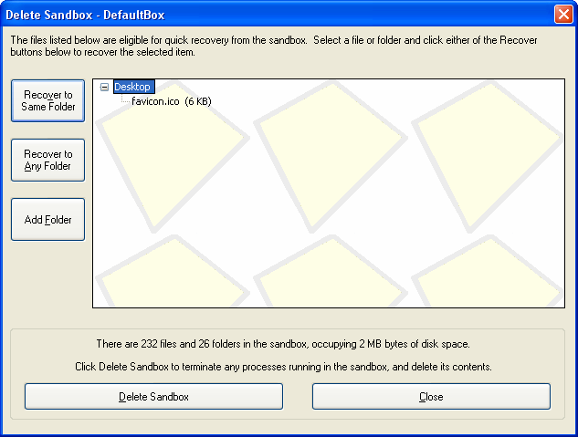

# 删除沙盒

[沙盒管理器](SandboxieControl.md) > [沙盒菜单](SandboxMenu.md) > 删除内容

[沙盒管理器](SandboxieControl.md) > [托盘图标菜单](TrayIconMenu.md) > 删除内容

当沙盒即将被删除时，会出现_删除沙盒_窗口。窗口分为两个区域：

*   上半部分（约占窗口 3/4）显示 [快速恢复](QuickRecovery.md) 的界面和控件，其操作方式与_快速恢复_窗口相同。更多信息参见 [快速恢复](QuickRecovery.md)。

*   下半部分统计沙盒大小（文件、文件夹和磁盘空间字节数），并包含_删除沙盒_按钮，用于启动沙盒的删除处理。

当调用 [沙盒菜单 > 沙盒 > 删除内容](SandboxMenu.md#沙盒菜单) 命令（或 [托盘图标菜单](TrayIconMenu.md) 中的相应命令）时，会显示该窗口。

如果沙盒配置为自动删除（参见 [沙盒设置 > 删除 > 调用方式](DeleteSettings.md#调用方式)），且有任何文件符合 [快速恢复](QuickRecovery.md) 条件，也会显示该窗口。注意：如果没有符合条件的文件，沙盒会被静默删除，不显示_删除沙盒_窗口。

注意：_删除沙盒_命令会终止沙盒中运行的所有程序并启动删除过程。点击_删除沙盒_按钮后，空沙盒立即可用于运行程序。在旧沙盒的删除处理进行期间，Sandboxie 托盘图标会变为红色 X 图标，表示沙盒删除正在进行。正常情况下，红色 X 图标不应显示超过几秒钟。

* * *

前往 [快速恢复](QuickRecovery.md)、[沙盒管理器](SandboxieControl.md)、[帮助主题](HelpTopics.md)。
