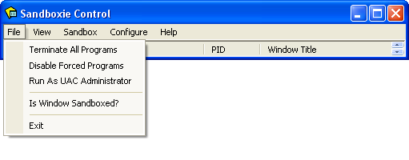
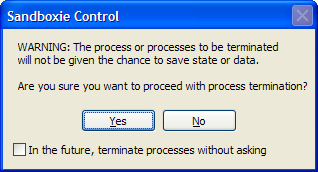
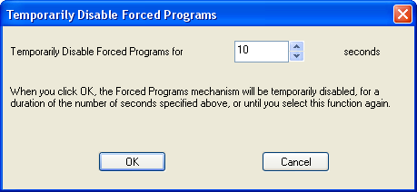
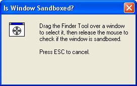

# 文件菜单

[沙盒管理器](SandboxieControl.md) > 文件菜单

* * *

### 终止所有程序

[沙盒管理器](SandboxieControl.md) > [文件菜单](FileMenu.md) > 终止所有程序

_终止所有程序_ 命令立即停止所有沙盒中运行的全部程序。此命令没有关联窗口。不过，你可能会收到关于即将被终止的程序所处理数据可能丢失的警告：

此警告涉及例如任何不会保存的已打开文档。可以通过勾选底部的复选框 _以后终止进程时不再询问_ 来禁用此警告。

另请参阅：[托盘图标菜单](TrayIconMenu.md) 中的 [终止所有程序](TrayIconMenu.md#终止所有程序)。

* * *

### 禁用强制程序

[沙盒管理器](SandboxieControl.md) > [文件菜单](FileMenu.md) > 禁用强制程序

_禁用强制程序_ 切换命令会临时禁用或重新启用强制沙盒化。通常，任何 [强制程序](ProgramStartSettings.md#强制程序)（或 [强制文件夹](ProgramStartSettings.md#强制文件夹) 中的程序）都会在 Sandboxie 的监管下自动启动。调用禁用强制程序命令时，强制沙盒化会被临时暂停。

默认情况下，强制沙盒化暂停 10 秒。秒数可以在选择此命令时出现的以下对话框中更改。

注意：[托盘图标菜单](TrayIconMenu.md) 中的相应命令不显示此对话框，而是使用上次指定的持续时间，或默认的 10 秒。

在禁用强制程序模式生效期间：

*   系统托盘区域的 Sandboxie 图标会带有一个红色 X。
*   [文件菜单](FileMenu.md) 和 [托盘图标菜单](TrayIconMenu.md) 中的“禁用强制程序”命令旁边会出现一个对勾标记。
*   如果有强制程序被启动，会发出 [SBIE1301](SBIE1301.md) 消息。
*   再次选择此命令将取消该模式，使图标恢复原样，并恢复正常执行强制沙盒化。

另请参阅：[托盘图标菜单](TrayIconMenu.md) 中的 [禁用强制程序](TrayIconMenu.md#禁用强制沙盒化程序)。

* * *

### 以 UAC 管理员身份运行

[沙盒管理器](SandboxieControl.md) > [文件菜单](FileMenu.md) > 以 UAC 管理员身份运行

_以 UAC 管理员身份运行_ 切换命令指示 Sandboxie 在启动任何程序前请求提升到管理员权限。此命令仅在 Windows 的用户帐户控制（UAC）生效且用户帐户尚未提升时可用。如果此命令在菜单中可用，那么在向沙盒中安装程序之前通常需要启用它，并建议在安装完成后禁用它。

此命令没有关联窗口。不过，在 _以 UAC 管理员身份运行_ 生效期间，该命令会在 [文件菜单](FileMenu.md) 和 [托盘图标菜单](TrayIconMenu.md) 中显示并带有一个对勾标记。

另请参阅：[托盘图标菜单](TrayIconMenu.md) 中的 [以 UAC 管理员身份运行](TrayIconMenu.md#以-uac-管理员身份运行)。

* * *

### 窗口是否在沙盒中？

[沙盒管理器](SandboxieControl.md) > [文件菜单](FileMenu.md) > 窗口是否在沙盒中？

_窗口是否在沙盒中？_ 命令用于选择屏幕上显示的窗口，如果该窗口属于沙盒化程序，命令会显示程序名称及其所在的沙盒。

要使用此命令，请在_查找工具_（即窗口中带靶标的图标）上按住鼠标左键。不要松开左键，将靶标拖到目标窗口上，当靶标进入目标窗口边界内时，松开左键。

如果该窗口属于沙盒化程序，Sandboxie 会显示程序名称和沙盒名称，将视图切换到 [程序视图](ProgramsView.md)，并高亮该程序。

有些程序使用自定义图形显示窗口，这使 Sandboxie 无法在标题栏显示 [#] 标记。在这些情况下，你可以使用 _窗口是否在沙盒中？_ 命令来确认窗口及其相关程序确实以沙盒化方式运行。

* * *

### 退出

[沙盒管理器](SandboxieControl.md) > [文件菜单](FileMenu.md) > 退出

_退出_ 命令退出 [沙盒管理器](SandboxieControl.md)。注意：仅仅关闭窗口（或从 [托盘图标菜单](TrayIconMenu.md) 选择 _隐藏窗口_ 命令）_并不会_退出沙盒管理器。

即使前端程序沙盒管理器未运行，Sandboxie 仍然处于活动状态并正确监管程序。不过，以下功能由沙盒管理器提供，当前端程序未运行时将不可用：

*   自动删除沙盒
*   快速恢复和即时恢复
*   禁用强制程序模式（当从 [Sandboxie Start](StartCommandLine.md) 程序启动时）

如果你不希望系统托盘区域显示沙盒管理器，可以考虑把 Windows 任务栏配置为始终隐藏该图标，而不是退出沙盒管理器。

* * *

前往 [沙盒管理器](SandboxieControl.md#菜单)、[托盘图标菜单](TrayIconMenu.md)、[帮助主题](HelpTopics.md)。
