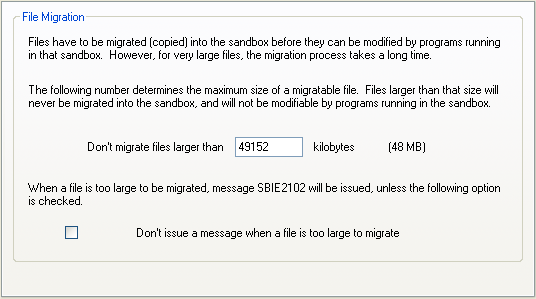

# 文件迁移设置

[沙盒管理器](SandboxieControl.md) > [沙盒设置](SandboxSettings.md) > 文件迁移：

在沙盒化程序可以更改计算机中已存在的文件之前，Sandboxie 必须先在沙盒中复制该文件。然而，复制非常大的文件会是耗时操作。因此，Sandboxie 只复制低于某个最大大小的文件。大于此大小的文件在沙盒内将被视为只读，任何修改它们的尝试都会导致 [SBIE2102](SBIE2102.md) 消息。

使用此设置页设置最大大小阈值，以及当尝试修改大于该最大大小的文件时，是否希望看到 [SBIE2102](SBIE2102.md) 消息。

相关 [Sandboxie Ini](SandboxieIni.md) 设置项：[复制限制 Kb](CopyLimitKb.md)、[复制限制静默](CopyLimitSilent.md)。
