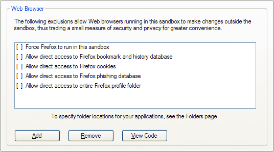
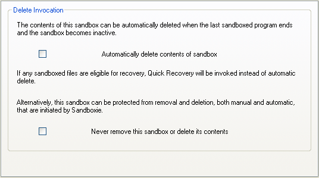
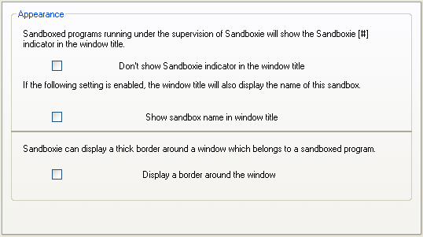

# Firefox 技巧

## Firefox 专属提示

[沙盒管理器](SandboxieControl.md) > [沙盒设置](SandboxSettings.md) > [应用程序 > Web 浏览器 > Firefox](ApplicationsSettings.md#firefox)

* * *

**总是以沙盒方式运行**

*   设置：强制 Firefox 在此沙盒中运行

此设置让 Sandboxie 自动监管 Firefox 启动的任何实例，即使它不是通过 Sandboxie 的设施或命令直接启动的。

* * *

**更新 Firefox 及其附加组件**

在默认配置下，对 Firefox 或其附加组件的任何更新都只会在沙盒内进行。当沙盒被删除时，所有这些更新也会被删除。为避免此问题，当你发现有任何可用更新时，应在沙盒外运行 Firefox。让正常的 Firefox 完成更新，包括 Firefox 所需的任何重启。最后，退出 Firefox 并在 Sandboxie 下重新启动它。

如果 Firefox 被强制始终在 Sandboxie 下运行（如上所述），请使用 [禁用强制程序](FileMenu.md#禁用强制程序) 命令禁用强制沙盒化几分钟。然后执行上一段中的步骤。最后，再次使用 _禁用强制程序_ 命令恢复强制沙盒化。

* * *

**书签、历史记录和收藏夹**

*   设置：允许直接访问 Firefox 书签和历史记录数据库

此设置允许在 Sandboxie 下运行的 Firefox 把书签存储在沙盒外，因此即使在沙盒被删除后它们也能保留。当未设置此选项时，书签只存储在沙盒中，沙盒被删除时会被删除。

请注意，从 Firefox 3 开始，同一个文件（名为 _places.sqlite_）同时存储书签和访问过的网站历史记录。因此此设置也会让 Firefox 把访问过的历史记录存储在沙盒外。

~~一种做法是安装 [PlainOldFavorites](https://www.iosart.com/firefox/plainoldfavorites) 附加组件，它让 Firefox 除了 Mozilla 风格的书签外，还能创建和管理 Internet Explorer 风格的收藏夹。然后请参阅 [Internet Explorer 使用技巧](InternetExplorerTips.md#收藏夹) 中关于收藏夹的讨论。~~

**底线：**

~~*   如果你不介意额外的附加组件，安装 PlainOldFavorites 为 Firefox 增强 Internet Explorer 风格的收藏夹，然后阅读 [Internet Explorer 使用技巧](InternetExplorerTips.md) 中关于处理收藏夹的建议。~~
*   如果你对 Firefox 书签满意，请选中此设置。

* * *

**Cookie**

*   设置：允许直接访问 Firefox Cookie

此设置允许在 Sandboxie 下运行的 Firefox 把 Cookie 存储在沙盒外（在一个名为 _cookies.sqlite_ 的文件中），因此即使在沙盒被删除后它们也能保留。当未设置此选项时，Cookie 只存储在沙盒中，沙盒被删除时会被删除。

此设置的替代方法是：先用普通的 Firefox 访问一次你最喜欢的网站，让这些网站通过 Cookie 记住你。然后切换到 Sandboxie 下的 Firefox，这样任何新 Cookie 都会保留在沙盒中，直到你删除沙盒。

**底线：**

*   如果你经常删除 Cookie，并计划开始经常使用 Sandboxie，那么可以保持此设置不选中，这样你就不必继续经常删除 Cookie。
*   如果你需要沙盒化 Firefox 中访问的网站记住你，请选中此设置。

* * *

**钓鱼数据库**

*   设置：允许直接访问 Firefox 钓鱼数据库

此设置允许在 Sandboxie 下运行的 Firefox 更新和维护钓鱼网站数据库（名为 _urlclassifier*.sqlite_ 的文件）。当未设置此选项时，每当沙盒被删除，Firefox 可能都要花时间把钓鱼数据库（可能是一个非常大的文件）复制到沙盒中，然后下载数据库的更新。此设置默认启用。

**底线：** 保持此设置选中。

* * *

**完整配置文件访问**

*   设置：允许直接访问整个 Firefox 配置文件文件夹

此设置允许在 Sandboxie 下运行的 Firefox 访问整个 Firefox 配置文件中的任何数据文件。此设置涵盖上面提到的任何其他 Firefox 数据文件，并覆盖前面讨论的所有其他“直接访问”设置。

**底线：** 不要选中此设置。

* * *

## 通用提示

**自动删除沙盒**

[沙盒管理器](SandboxieControl.md) > [沙盒设置](SandboxSettings.md) > [删除](DeleteSettings.md) > [调用方式](DeleteSettings.md#调用方式)

*   设置：自动删除沙盒内容

此设置让 Sandboxie 在沙盒中的所有程序停止运行时删除沙盒。

* * *

**高亮显示在 Sandboxie 下运行的程序窗口**

[沙盒管理器](SandboxieControl.md) > [沙盒设置](SandboxSettings.md) > [外观设置](AppearanceSettings.md)

*   设置：在窗口周围显示边框

此设置让 Sandboxie 在属于此沙盒中运行程序的窗口周围绘制彩色边框。默认颜色是黄色，但你可以为每个沙盒选择不同的颜色。

或者，如果你希望模糊在 Sandboxie 监管下运行的程序与未在其监管下运行的程序之间的区别，请选择“不在窗口标题中显示 Sandboxie 指示符”设置。
