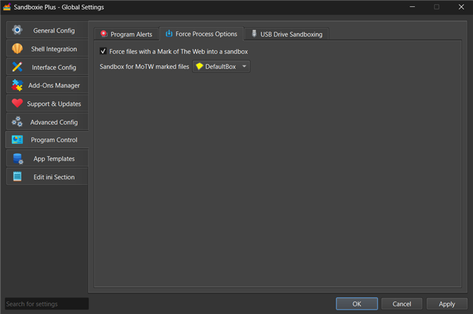

# 强制网络标记

_ForceMarkOfTheWeb_ 是 [Sandboxie Ini](SandboxieIni.md) 中的一项全局设置。启用时，它强制所有带网络标记（MOTW）的文件自动沙盒化到指定沙盒中。这通过确保从互联网下载或通过电子邮件收到的文件被自动隔离，提供增强的安全性。

## 设置

此功能使用两项全局设置：

### ForceMarkOfTheWeb

```
[GlobalSettings]
ForceMarkOfTheWeb=y
```

启用带网络标记属性文件的自动沙盒化。

### MarkOfTheWebBox

```
[GlobalSettings]
MarkOfTheWebBox=Web_Box
```

指定 MOTW 文件应使用哪个沙盒。未指定时默认值为 `DefaultBox`。

## 什么是网络标记？

网络标记（MOTW）是 Windows 中的一项安全功能，把文件标记为源自互联网或其他不受信任的位置。Windows 自动将此标记应用于：

- 从网页浏览器下载的文件
- 电子邮件附件
- 从已下载的 ZIP 压缩包中提取的文件
- 通过即时通讯应用程序收到的文件
- 从标记为 Internet 区域的网络共享复制的文件

## 重要说明

- 这是影响系统上所有沙盒的**全局设置**
- 指定的沙盒必须已存在于你的 Sandboxie 配置中并已启用
- 沙盒名称区分大小写，必须完全匹配
- 已在任何沙盒中运行的文件不受此设置影响

## 故障排除

如果 MOTW 文件未被沙盒化：

1. **确认两个设置都已配置：**
   - `ForceMarkOfTheWeb=y` 已设置在 `[GlobalSettings]` 中
   - `MarkOfTheWebBox=沙盒名称` 指向现有沙盒
2. **检查沙盒名称：** 确保沙盒名称完全匹配（区分大小写）
3. **确认沙盒存在且已启用**
4. **确认文件具有 MOTW 属性：** 使用 `dir /r 文件名` 检查 `Zone.Identifier` 流

## 类似设置

- [强制进程](ForceProcess.md)：把特定程序强制进沙盒
- [强制文件夹](ForceFolder.md)：把特定文件夹中的文件强制进沙盒

## 用户界面

此设置可以在 Sandboxie Plus 中通过以下路径配置：
**全局设置 > 程序控制 > 强制程序选项**


