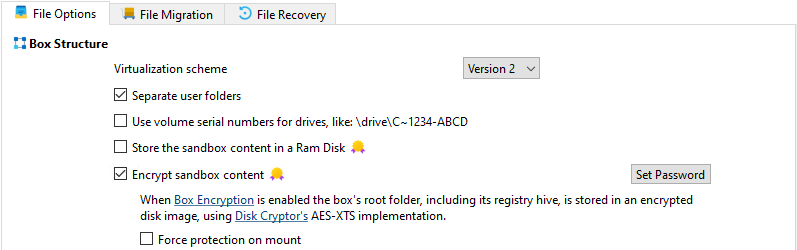

# 挂载时强制保护

_ForceProtectionOnMount_ 是 [Sandboxie.ini](SandboxieIni.md) 中的一个沙盒设置项（在 v1.13.4 / 5.68.4 版本中引入），它会强制一个基于文件的沙盒映像在挂载时启用根目录保护。设置后，挂载流程以及挂载/创建对话框会强制启用映像根目录保护选项，用户将无法在无保护的情况下挂载该映像。

## 用法

```ini
[DefaultBox]

ForceProtectionOnMount=y
```

## 适用场景

- 当你希望沙盒映像始终以保护模式挂载时（防止沙盒外的进程访问已挂载的映像）。

- 对于加密映像非常有用，可以确保在挂载时就提供保护。

## 行为与界面

- 在 通用 / 文件选项 的用户界面中，有一个与 `ForceProtectionOnMount` 绑定的复选框 (代码中为 `ui.chkForceProtection`)。
    - 该复选框仅在沙盒被配置为[加密沙盒](UseFileImage.md) 时才可用 (不适用于内存盘模式).

      

- 当通过程序强制显示沙盒映像挂载对话框时调用 `CBoxImageWindow::SetForce(true)`:
    - 强制勾选 `ui.chkProtect`，
    - 并禁用该保护复选框，用户无法取消勾选，

      

    - 同时在对话框中强制勾选并禁用 `ui.chkAutoLock` （当最后一个进程停止时自动卸载）。  
- 挂载时，服务会收到一个设置了 `protect_root` 标志的挂载请求；挂载管理器和驱动程序会强制执行保护。

## 技术说明与代码参考

- UI 读取/写入:
    - 读取: `m_pBox->GetBool("ForceProtectionOnMount", false)` (详见 `COptionsWindow::LoadGeneral`)。[^1]
    - 写入: `WriteAdvancedCheck(ui.chkForceProtection, "ForceProtectionOnMount", "y", "")`。 (详见 `COptionsWindow::SaveGeneral`)[^1]

- 挂载通信协议:
    - `IMBOX_MOUNT_REQ` 包含  `BOOL protect_root;` (挂载通信协议头文件 `MountManagerWire.h`)。[^2]

- 挂载对话框强制执行:
    - `CBoxImageWindow::SetForce(bool force)` 设置保护复选框的启用/勾选状态。[^3]

- 挂载流程:
    - `MountManager::AcquireBoxRoot` (挂载管理器) 会在适当时机将 `protect_root` 标志包含在挂载请求中。[^4]

- 启动进程集成:
    - `Start.cpp` 在沙盒启动和进程创建期间处理 `mount_protected` 参数。[^5]

## 兼容性与限制

- 仅对使用 `UseFileImage`（基于文件的 `.box` 映像）的沙盒有意义。
- 如果文件系统驱动或挂载管理器不支持保护性挂载（或加密容器），挂载可能会失败，沙盒也无法启动——请检查日志和挂载管理器的错误信息。
- 根目录保护在挂载时强制执行；如果在有进程运行时卸载映像，这些进程将被终止。

## 最佳实践

- 按需为单个沙盒设置（除非你打算为所有沙盒强制启用保护，否则不要全局设置）。

## 相关内容

- [`UseFileImage`](UseFileImage.md) - 启用基于文件的沙盒映像。
- `CBoxImageWindow::SetForce` - 在挂载/创建对话框中强制执行 UI 选项。
- `IMBOX_MOUNT_REQ.protect_root` - 挂载管理器使用的挂载请求标志。
- [`StartCommandLine`](StartCommandLine.md#mount-box-images) - 命令行操作，包含用于保护性挂载的 `mount_protected` 开关。

[^1]: 见 UI 代码 `SandMan\Windows\OptionsGeneral.cpp` - `COptionsWindow::LoadGeneral` 和 `COptionsWindow::SaveGeneral` 通过 `m_pBox` 处理 `ForceProtectionOnMount` 键的读写。

[^2]: 挂载协议定义于 `..\Sandboxie\core\svc\MountManagerWire.h` - `tagIMBOX_MOUNT_REQ` 包含挂载管理器使用的 `protect_root` 字段。

[^3]: 实现代码位于 `SandMan\Windows\BoxImageWindow.cpp` - `CBoxImageWindow::SetForce(bool force)` 强制对话框复选框以反映强制保护挂载。

[^4]: 挂载管理器代码（挂载请求组装）会将 `protect_root` 标志传递给服务/驱动；见服务代码库中的挂载管理器实现（例如 `MountManager::AcquireBoxRoot`）。

[^5]: 启动进程实现位于 `Sandboxie\apps\start\Start.cpp` - 在沙盒启动和进程初始化期间处理 `mount_protected` 参数。