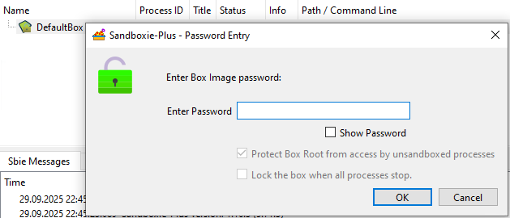

# 挂载时强制保护

_ForceProtectionOnMount_ 是 [Sandboxie Ini](SandboxieIni.md) 中的一项沙盒设置（v1.13.4 / 5.68.4 引入），它强制以启用根保护的方式挂载基于文件的沙盒映像。设置后，挂载流程和挂载/创建对话框都会强制启用映像根保护选项，使用户无法在无保护的情况下挂载映像。

## 用法

```ini
[DefaultBox]

ForceProtectionOnMount=y
```

## 何时使用

- 你希望沙盒映像始终以受保护模式挂载（防止非沙盒化进程访问已挂载的映像）。

- 对加密映像很有用，你希望在挂载时保证保护。

## 行为和界面

- 常规/文件选项界面暴露一个绑定到 `ForceProtectionOnMount`（代码中的 `ui.chkForceProtection`）的复选框。
    - 只有当沙盒被配置为[加密沙盒](UseFileImage.md)时（而非内存虚拟磁盘），该复选框才可用。

      

- 当沙盒映像挂载对话框以编程方式显示并应用强制时，`CBoxImageWindow::SetForce(true)`：
    - 强制 `ui.chkProtect` 被勾选，
    - 禁用保护复选框，使用户无法取消勾选，

      

    - 强制对话框中的 `ui.chkAutoLock`（最后一个进程停止时自动卸载）被勾选/禁用。  
- 挂载时，服务会收到带 `protect_root` 标志设置的挂载请求；挂载管理器和驱动程序强制实施保护。

## 技术说明 / 代码参考

- 界面读/写：
    - 读取：`m_pBox->GetBool("ForceProtectionOnMount", false)`（参见 `COptionsWindow::LoadGeneral`）。[^1]
    - 保存：`WriteAdvancedCheck(ui.chkForceProtection, "ForceProtectionOnMount", "y", "")`（参见 `COptionsWindow::SaveGeneral`）。[^1]

- 挂载通信协议：
    - `IMBOX_MOUNT_REQ` 包含 `BOOL protect_root;`（`MountManagerWire.h` 中的挂载连线协议头）。[^2]

- 挂载对话框强制：
    - `CBoxImageWindow::SetForce(bool force)` 设置保护复选框的启用/勾选状态。[^3]

- 挂载流程：
    - 适当时，`MountManager::AcquireBoxRoot`（挂载管理器）会在挂载请求中包含 `protect_root` 标志。[^4]

- 启动进程集成：
    - `Start.cpp` 在沙盒启动和进程创建期间处理 `mount_protected` 参数。[^5]

## 兼容性与约束

- 仅对使用 `UseFileImage`（基于文件的 `.box` 映像）的沙盒有意义。
- 如果文件系统驱动或挂载管理器无法实现受保护挂载（或加密容器），挂载可能失败且沙盒不会启动——请检查日志和挂载管理器错误。
- 根保护在挂载时强制实施；进程运行时卸载将终止这些进程。

## 最佳实践

- 按沙盒应用（除非你打算为每个沙盒强制保护，否则不要全局设置）。

## 相关

- [`使用文件映像`](UseFileImage.md) - 启用基于文件的沙盒映像。
- `CBoxImageWindow::SetForce` - 挂载/创建对话框上的界面强制。
- `IMBOX_MOUNT_REQ.protect_root` - 挂载管理器使用的挂载请求标志。
- [`启动命令行`](StartCommandLine.md#挂载沙盒镜像) - 命令行操作，包括用于受保护挂载的 `mount_protected` 开关。

[^1]: 参见 `SandMan\Windows\OptionsGeneral.cpp` 中的界面代码 - `COptionsWindow::LoadGeneral` 和 `COptionsWindow::SaveGeneral` 通过 `m_pBox` 处理 `ForceProtectionOnMount` 键的读写。
[^2]: `..\Sandboxie\core\svc\MountManagerWire.h` 中的挂载协议定义 - `tagIMBOX_MOUNT_REQ` 包含挂载管理器使用的 `protect_root` 字段。
[^3]: `SandMan\Windows\BoxImageWindow.cpp` 中的实现 - `CBoxImageWindow::SetForce(bool force)` 强制对话框复选框反映强制的受保护挂载。
[^4]: 挂载管理器代码（挂载请求组装）会把 `protect_root` 标志传播到服务/驱动；参见服务代码库中的挂载管理器实现（例如 `MountManager::AcquireBoxRoot`）。
[^5]: `Sandboxie\apps\start\Start.cpp` 中的启动进程实现 - 在沙盒启动和进程初始化期间处理 `mount_protected` 参数。
