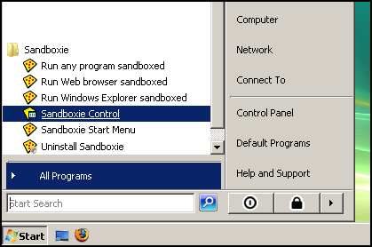

# 入门指南

### 第一部分：简介

Sandboxie 在一个称为沙盒的隔离抽象区域中运行你的应用程序。在 Sandboxie 的监管下，应用程序正常运行且保持全速，但无法对你的计算机造成永久更改。这些更改只会在沙盒内发生。

本入门教程将向你展示：

  * 如何用 Sandboxie 运行你的应用程序
  * 更改如何被拦截在沙盒中
  * 如何从沙盒中恢复重要的文件和文档
  * 如何删除沙盒

或者直接跳到 [入门指南第六部分](GettingStartedPartSix.md)，那里讨论了一些收尾要点。

你也可以查看 [外部教程](ExternalTutorials.md) 页面，获取更多关于 Sandboxie 的教程链接，有些是非英语语言，有些是视频形式而非文字。

* * *

### 沙盒管理器界面

Sandboxie 经典版通过 [沙盒管理器](SandboxieControl.md) 程序进行操作。该程序会在任务栏的系统通知（“托盘”）区域添加黄色 Sandboxie 图标：

如果 [沙盒管理器](SandboxieControl.md) 尚未运行，你可以从 Windows 开始菜单的 Sandboxie 程序组中找到并启动它：

运行时，你可以双击 Sandboxie 托盘图标来隐藏和显示 [沙盒管理器](SandboxieControl.md) 的主窗口。或者右键点击图标并选择第一个命令，该命令会在 _隐藏窗口_ 与 _显示窗口_ 之间切换。

本教程要求 [沙盒管理器](SandboxieControl.md) 的主窗口保持可见。

* * *

你应该在沙盒化的网页浏览器中阅读本教程。为此，请使用 [沙盒管理器](SandboxieControl.md) [帮助菜单](HelpMenu.md) 中的 _入门教程（网页版）_ 命令，并确保让 [沙盒管理器](SandboxieControl.md) 以**沙盒化**方式运行你的浏览器：

教程在 [入门指南第二部分](GettingStartedPartTwo.md) 继续。
