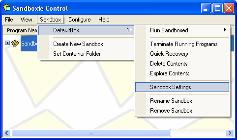

# 入门指南 第五部分

### 第五部分：删除沙箱

当你在沙盘中使用应用程序结束，并且已经恢复了下载的文件、文档及其他所需的工作项后，建议你删除沙箱的内容。点击 [托盘图标菜单](TrayIconMenu.md) 中的 **删除内容** 命令：

你也可以在 沙盘控制 主界面的 [沙箱菜单](SandboxMenu.md) 中调用 **删除内容** 命令。

* * *

此时将出现 [删除沙箱](DeleteSandbox.md) 窗口，为你提供最后一次机会，以便恢复仍保留在沙箱内的任何文件：

上述图片窗口的上半部分，就是上一部分介绍过的快速恢复命令。下半部分则显示了沙箱内容的累计大小。

最后，当你确定已经恢复所需的所有内容后，点击 _删除沙箱_ 来删除沙箱。

请注意，无论沙箱的大小如何，删除过程总是只需几秒钟。这是正常且预期的现象。在此期间，Sandboxie 托盘图标会变为红色 X 图标，以表示正在进行沙箱删除操作。

* * *

在默认配置下，沙箱内容不会自动删除，因此每当你想要删除沙箱内容时，都需要手动调用 **删除内容** 命令。

你可以通过修改设置来改变这种行为。在 [沙盘控制](SandboxieControl.md) 主界面中，使用 [沙箱菜单](SandboxMenu.md) 打开 [沙箱设置](SandboxSettings.md) 窗口：

将会弹出 [沙箱设置](SandboxSettings.md) 窗口。点击 _删除_ 展开删除设置分组，然后点击 _调用_，以显示 [删除 > 调用](DeleteSettings.md#invocation) 设置页面：

在 _自动删除沙箱内容_ 选项框中打勾，即可让沙盘按照设置页面中的描述，自动调用删除沙箱命令。

* * *

本教程将在 [入门指南第六部分](GettingStartedPartSix.md) 结束。