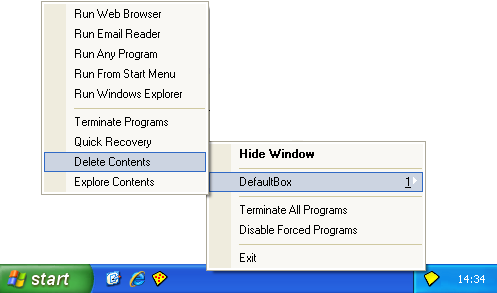
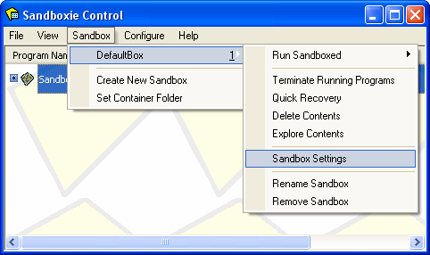
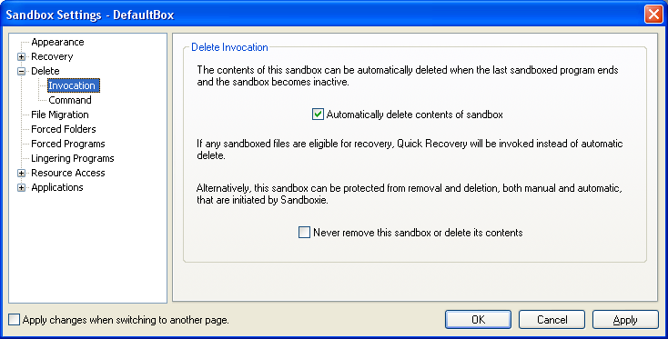

# 入门指南第五部分

### 第五部分：删除沙盒

当你在 Sandboxie 下用完某个应用程序，并已恢复下载的文件、文档和其他需要的工作成果后，删除沙盒内容是个好主意。点击 [托盘图标菜单](TrayIconMenu.md) 中的**删除内容**命令：

你也可以从沙盒管理器主窗口的 [沙盒菜单](SandboxMenu.md) 调用**删除内容**命令。

* * *

出现 [删除沙盒](DeleteSandbox.md) 窗口，给你最后一次机会恢复仍留在沙盒中的文件：

上图窗口的上半部分就是上一部分介绍过的快速恢复命令。下半部分统计沙盒内容的累计大小。

最后，当你确认已恢复所有需要的内容后，点击 _删除沙盒_ 删除沙盒。

注意：无论沙盒多大，删除过程都只需几秒钟，这应视为正常现象。在此期间，Sandboxie 托盘图标会变为红色 X 图标，表示沙盒删除正在进行。

* * *

在默认配置下，沙盒不会自动删除，因此每当你想删除沙盒内容时，都需要手动调用**删除内容**命令。

此行为可以通过更改设置来改变。在 [沙盒管理器](SandboxieControl.md) 主窗口中，用 [沙盒菜单](SandboxMenu.md) 打开 [沙盒设置](SandboxSettings.md) 窗口：

出现 [沙盒设置](SandboxSettings.md) 窗口。点击 _删除_ 展开删除设置组，再点击 _调用方式_ 显示 [删除 > 调用方式](DeleteSettings.md#调用方式) 设置页：

勾选 _自动删除沙盒内容_ 复选框，即可让 Sandboxie 自动调用删除沙盒命令，如设置页所述。

* * *

教程在 [入门指南第六部分](GettingStartedPartSix.md) 结束。
