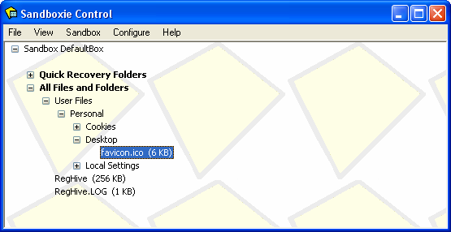
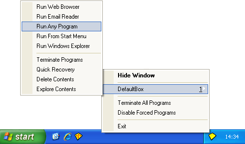
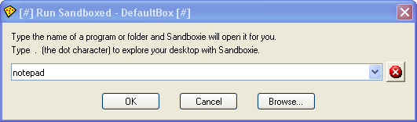
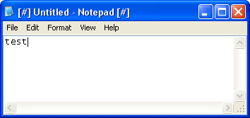
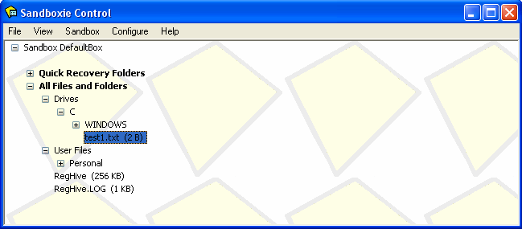

# 入门指南第三部分

### 第三部分：沙盒

现在你的网页浏览器应该已经以_沙盒化_方式运行，可以是 Internet Explorer 或任何其他浏览器。

浏览器程序可能会对计算机做出更改，这些更改将全部被拦截在沙盒中。

现在就试试。右键点击下面的链接，将文件保存到桌面。如果使用 Internet Explorer，这是右键菜单中的 _目标另存为_ 命令；如果使用 Firefox，则是右键菜单中的 _链接另存为_ 命令：

[favicon.ico](https://github.com/sandboxie-plus/sandboxie-docs/raw/main/Media/favicon.ico)

在默认且推荐的配置下，Sandboxie 会识别出文件被保存到了感兴趣的位置（本例中是你的桌面），并为该文件提供 [即时恢复](ImmediateRecovery.md)：

本次练习的重点是展示文件在恢复前会一直留在沙盒中，因此请点击上方窗口的 _关闭_ 按钮，让 Sandboxie 把文件留在沙盒内。

你保存的文件 _favicon.ico_ 会以这样的图标出现在桌面上：

如果最小化所有窗口并查看桌面，你_应该_看不到新图标，因为该文件实际上保存_在沙盒中_，尚未恢复。

[沙盒管理器](SandboxieControl.md) 最初以 [程序视图](ProgramsView.md) 运行，列出沙盒中运行的程序；但你可以用 [视图菜单](ViewMenu.md) 把视图模式切换为 [文件和文件夹视图](FilesAndFoldersView.md)，后者显示沙盒的内容。在 _视图_ 菜单中点击 _文件和文件夹_。

展开分支（点击 **_+_** 符号），即可看到按文件夹组织的沙盒内容。如上图所示，你之前保存的 _favicon.ico_ 文件被放进了_沙盒化的_桌面文件夹。

* * *

同样，任何沙盒化程序创建的文件都会被放进沙盒中与实际文件夹对应的沙盒文件夹里——即该文件“本应”被放置的真实文件夹。

我们再试一次，这次用沙盒化的记事本。为此，使用 _运行任意程序_ 命令：

Sandboxie 会显示它的 _运行..._ 对话框。输入 **notepad**：

记事本应以沙盒化方式启动：

在新建的记事本文档中输入几个字符，并将其以文件名 _test1.txt_ 保存到 C 盘根目录。然后在 C 盘根目录中寻找这个文件——你应该找不到它，因为文件被保存在沙盒中：

* * *

小结：

*   沙盒化程序创建或修改的文件最初会放在沙盒中。

*   沙盒内的文件对沙盒外的程序不可见。

* * *

教程在 [入门指南第四部分](GettingStartedPartFour.md) 继续。
