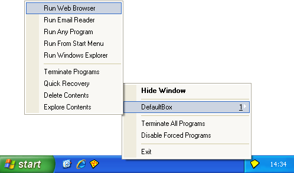

# 入门指南第二部分

### 第二部分：运行网页浏览器

要启动网页浏览器，请找到桌面上的沙盒化网页浏览器快捷方式图标并点击它：

或者，右键点击 [沙盒管理器](SandboxieControl.md) 的托盘图标，在弹出的 [托盘图标菜单](TrayIconMenu.md) 中选择 _运行网页浏览器_ 操作。

第三种方式是通过沙盒管理器主窗口中的 [沙盒菜单](SandboxMenu.md)：

* * *

你的网页浏览器应该以_沙盒化_方式启动。判断程序是否处于沙盒中，可以看它的窗口标题栏是否包含额外的 Sandboxie **[#]** 标记：（注意：较新的浏览器可能不在标题栏显示 #，但如果将鼠标悬停在窗口边缘，边缘会变黄。）

（注意：在某些计算机系统上，选择 _运行网页浏览器_ 时 Sandboxie 可能启动了错误的程序。如果遇到这种情况，请参阅 [常见问题解答](FrequentlyAskedQuestions.md#为什么沙盒运行默认-web-浏览器时启动了错误的程序) 解决。）

沙盒化程序应出现在 [沙盒管理器](SandboxieControl.md) 的主窗口中：

窗口显示当前在 Sandboxie 监管下以_沙盒化_方式运行的程序列表。最初只有一个沙盒 _DefaultBox_，不过可以创建更多沙盒；参见 [沙盒菜单](SandboxMenu.md) 中的 [创建新沙盒](SandboxMenu.md#创建新沙盒) 命令。

上图显示 Sandboxie 正在运行三个程序。第一个 _iexplore.exe_ 代表 Internet Explorer，因为本教程假设使用的是 Internet Explorer 浏览器。如果系统默认浏览器是 Firefox 或 Opera，那么沙盒中运行的第一个程序将分别是 _firefox.exe_ 或 _opera.exe_。

截图还显示另外两个程序正在运行：**SandboxieRpcss.exe** 和 **SandboxieDcomLaunch.exe**。这些支持程序是 Sandboxie 的一部分。如果需要，它们会自动启动，无需你采取任何显式操作。参见 [服务程序](ServicePrograms.md)。

当 Sandboxie 在任一沙盒中积极运行程序时，托盘图标（位于屏幕角落）会显示红点：

* * *

教程在 [入门指南第三部分](GettingStartedPartThree.md) 继续。
