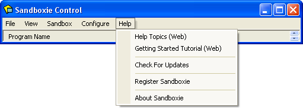
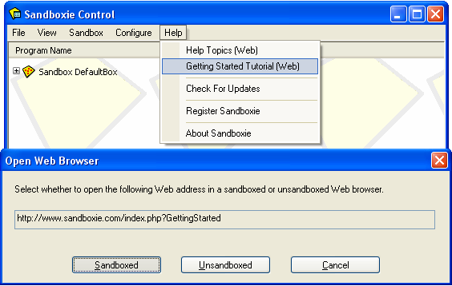
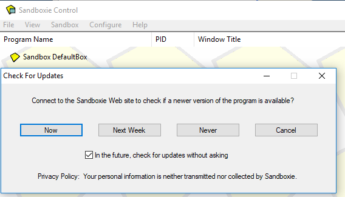
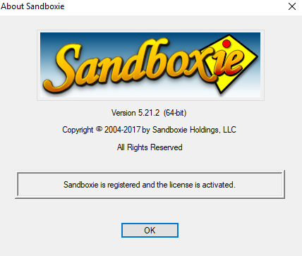

# 帮助菜单

[沙盒管理器](SandboxieControl.md) > 帮助菜单

* * *

### 帮助主题（网页版）

[沙盒管理器](SandboxieControl.md) > [帮助菜单](HelpMenu.md) > 帮助主题（网页版）

在本在线文档的 [帮助主题](HelpTopics.md) 页面打开网页浏览器。会打开一个窗口，询问网页浏览器是否应在 Sandboxie 的监管下运行（推荐）还是不运行。参见下文 [入门教程（网页版）](HelpMenu.md#入门教程-网页版)。

* * *

### 入门教程（网页版）

[沙盒管理器](SandboxieControl.md) > [帮助菜单](HelpMenu.md) > 入门教程（网页版）

在本在线文档的 [入门指南](GettingStarted.md) 页面打开网页浏览器。会打开一个窗口，询问网页浏览器是否应在 Sandboxie 的监管下运行（推荐）还是不运行：

* * *

### 检查更新

[沙盒管理器](SandboxieControl.md) > [帮助菜单](HelpMenu.md) > 检查更新

此命令检查 Sandboxie 网站是否报告了比计算机上安装的版本更新的 Sandboxie 版本。

*   点击**立即**按钮立即执行检查。
*   点击**下周**按钮把检查推迟到以后。
*   点击**从不**按钮禁用自动检查更新。

* * *

### 关于 Sandboxie

[沙盒管理器](SandboxieControl.md) > [帮助菜单](HelpMenu.md) > 关于 Sandboxie

显示 Sandboxie 程序的产品~~和注册~~信息。

* * *

前往 [沙盒管理器](SandboxieControl.md#菜单)、[帮助主题](HelpTopics.md)。
