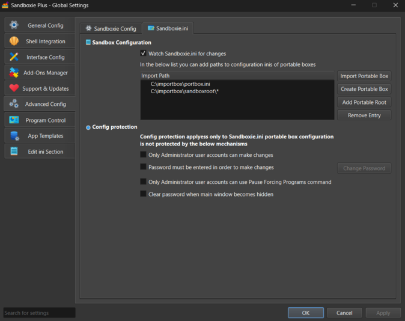

# 导入沙箱

**ImportBox** 是 [Sandboxie Ini](SandboxieIni.md) 中的沙箱设置。它允许用户从外部 INI 文件加载沙箱配置。

## 语法

```ini
ImportBox=<INI 文件的路径>
```

* **INI 文件的路径**: 包含沙箱配置设置的外部 INI 文件的完整路径。

## 目的

ImportBox 可以从外部 INI 文件加载沙箱，而不是将所有内容存储在主 Sandboxie.ini 文件中。这可以用来创建可移植的沙箱配置。

## 示例用法

### 基本导入

从外部文件导入沙箱设置：

```ini
[GlobalSettings]
ImportBox=C:\Sandboxes\PortableSandbox.ini
```

### 多重导入

您可以导入任意数量的沙箱：

```ini
[GlobalSettings]
ImportBox=C:\Sandboxes\SecureSandbox.ini
ImportBox=C:\Sandboxes\NoNetworkSandbox.ini
ImportBox=C:\Sandboxes\BrowserSandbox.ini
```

### 可移植配置示例

在任何地方创建一个可移植配置文件，例如 `C:\Sandboxes\BrowserBox.ini`：

```ini
[BrowserBox]
Enabled=y
```

> **重要:**  
> 从外部 INI 文件导入沙箱时，该文件必须包含恰好一个 section，并且该部分的名称必须与文件名（不带 `.ini` 扩展名）匹配。  
> 如果有额外的 sections，或者 section 的名称与文件名不匹配，导入将失败。

然后将其导入到 Sandboxie 中：

```ini
[GlobalSettings]
ImportBox=C:\Sandboxes\BrowserBox.ini
```

### 导入整个沙箱根目录

您可以使用通配符导入目录中所有沙箱配置，而无需手动导入每个特定沙箱：

```ini
[GlobalSettings]
ImportBox=C:\Sandboxes\*
```

这将导入指定目录中的所有 `.ini` 文件，使该文件夹中的任何沙箱可供使用。

## 用户界面

在 **Sandboxie Plus** 中，您可以通过以下路径管理 ImportBox 设置：

**全局设置** > **高级配置** > **Sandboxie.ini**

该界面允许您创建新的可移植沙箱，导入现有沙箱文件，或将目录添加为沙箱根目录以便自动导入目录中的沙箱。

