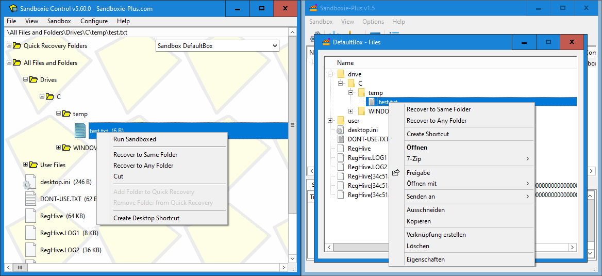
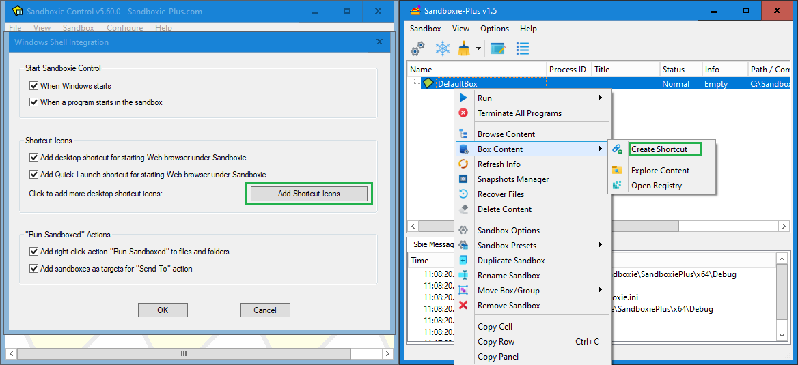
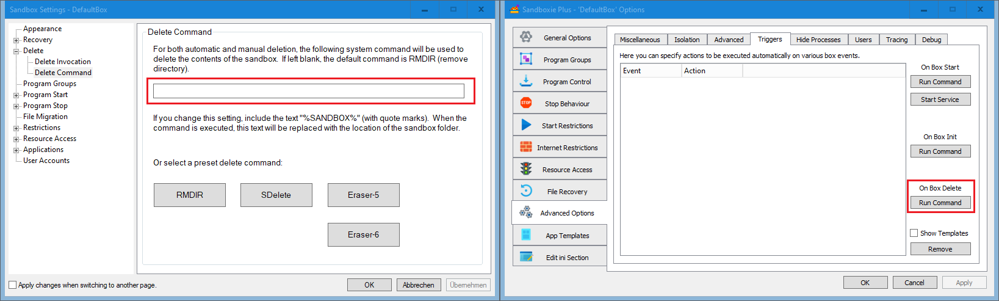

# 沙盘增强版（Sandboxie Plus）迁移指南

本指南展示了在新用户界面（UI）中可以找到所有已知沙盘功能的位置。

## 主窗口

当选择“简单视图”时，SandMan.exe主窗口的整体布局与SbieCtrl.exe中的旧布局完全相同。如果选择“高级视图”，窗口底部会有三个额外的选项卡（如“Sbie消息”等），因此它与右图所示内容相对应。

## 文件和沙箱菜单

所有重要的菜单命令都可以在类似的位置找到，尽管有些已经被移动了。

## 创建新沙箱对话框

“创建新沙箱”命令会打开新沙箱对话框。与经典版不同，这里可以选择沙箱类型预设。

复制现有沙箱的功能现在位于另一个位置。（请参阅以下单元。）

## 复制沙箱配置

要复制现有的沙箱配置，可以使用“复制沙箱”菜单命令。

## 视图菜单

“视图”菜单提供了更多功能，以及启用简化视图模式的选项。恢复日志不再是一个单独的窗口，而是底部的一个选项卡（选择“高级视图”时可见）。

## 视图菜单 - 文件和文件夹

现代沙盘UI已将“文件和文件夹”视图替换为一个单独的窗口，可以从沙箱上下文菜单中打开。

## 文件和文件夹 - 视图/窗口

“文件”窗口提供了与旧视图相同的功能，但通过提供完整的上下文菜单进行了增强。

## 全局设置

新的沙盘增强版（Sandboxie Plus）UI有一个全局设置窗口（选项 --> 全局设置），所有选项都位于垂直选项卡上，而不必打开单独的窗口。

## 文件系统根目录

在现代UI中，不仅可以更改文件系统根路径，还可以更改注册表根目录和IPC根目录。

## 程序启动监控

沙盘增强版（Sandboxie Plus）不仅可以在未沙箱化的进程启动时发出警告，还可以完全阻止它们启动。

## 外壳集成

在这个选项卡上，可以配置外壳集成。大多数功能都可用，尽管一些已弃用的功能已被删除，其他选项也被移走了。

## 创建沙箱快捷方式

要创建沙箱化程序的快捷方式，现在可以使用沙箱上下文菜单中的一个选项，这样可以更快地访问。

## 软件兼容性

兼容性对话框现在也集成到了全局设置窗口中（“兼容性”选项卡）。

## 锁定配置

从版本1.9.0 / 5.64.0开始，[配置保护](ConfigurationProtection.md)选项位于“高级配置”选项卡的子选项卡“Sandboxie.ini预设”中。

## 沙箱上下文菜单

沙箱上下文菜单更加高级，包含了旧菜单中的所有选项。现在双击沙箱名称会打开沙箱设置。

## 浏览内容

除了能够浏览内容外，“沙箱内容”子菜单还允许挂载和浏览沙箱化的注册表。

## 沙箱设置

旧版沙箱设置中的所有功能现在都位于沙箱选项中。有些区域相似，但很多也被移动了。

## 快速和即时恢复

快速恢复和即时恢复选项已合并到一个选项卡中（“文件恢复”）。

## 删除选项

删除选项已移至“常规选项”选项卡的子选项卡“文件选项”中。

## 删除命令

“删除命令”选项现在可以在“高级选项”选项卡的子选项卡“触发器”中找到。

## 程序组

新UI和旧UI一样支持程序组。

## 强制程序和文件夹

强制程序和文件夹也合并到一个选项卡中（“程序控制”，子选项卡“强制*程序”）。

## 残留程序和主程序

程序停止行为也合并到一个选项卡中。

## 文件迁移

文件迁移选项已集成到“常规选项”选项卡的“文件选项”子选项卡中。

## 互联网访问

沙盘增强版（Sandboxie Plus）不仅可以使用旧的阻止互联网访问方法，还可以使用Windows过滤平台（WFP），这提供了更好的兼容性。

## 网络访问

此外，使用WFP功能，可以为每个沙箱配置防火墙（“互联网限制”选项卡 --> 子选项卡“网络防火墙规则”）。

## 启动/运行访问

启动限制选项已提升为顶级选项卡。

## 放弃权限

“放弃管理员权限”选项在新UI中位于“常规选项”选项卡的“安全”子选项卡中，同时还有其他安全增强功能。

## 网络文件

“阻止网络文件和文件夹访问”已移至“常规选项”选项卡的“访问限制”子选项卡中。

## 资源访问

“资源访问”选项已集成到一个联合视图中，该视图在一个列表中显示所有预设，可以编辑和禁用这些选项而无需删除它们。

## 应用程序兼容性模板

兼容性模板现在也以联合视图的形式呈现（“应用模板”选项卡，子选项卡“兼容性模板”）。

## 用户账户

最后，将沙箱限制为选定用户的功能已移至“高级选项”选项卡的子选项卡“用户”中。

## 关于对话框

最后，我们有关于对话框。

显然，沙盘增强版（Sandboxie Plus）还有更多此处未显示的附加选项，因为本指南仅用于方便从经典版沙盘迁移到沙盘增强版（Sandboxie Plus）。