# Sandboxie Plus 迁移指南

本指南展示了在新用户界面（UI）中可以找到所有已知 Sandboxie 功能的位置。

## 主窗口

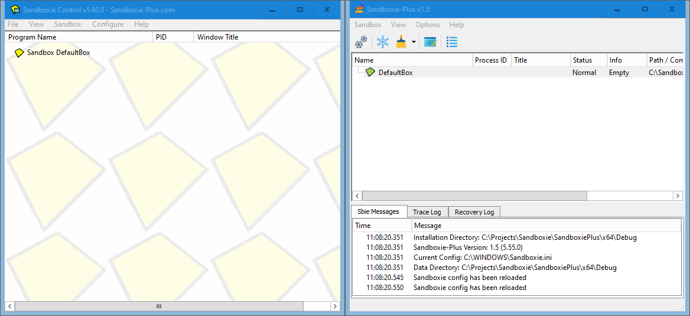

当选择“简单视图”时，SandMan.exe 主窗口的整体布局与 SbieCtrl.exe 中的旧布局完全相同。如果选择“高级视图”，窗口底部会有三个额外的选项卡（如“Sbie 消息”等），因此它与右图所示内容相对应。

## 文件和沙盒菜单

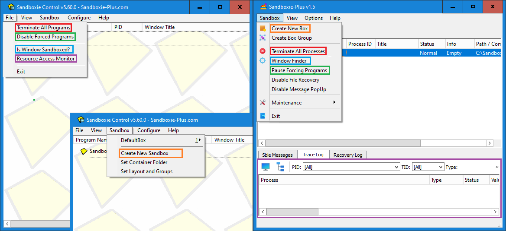

所有重要的菜单命令都可以在类似的位置找到，尽管有些已经被移动了。

## 创建新沙盒对话框

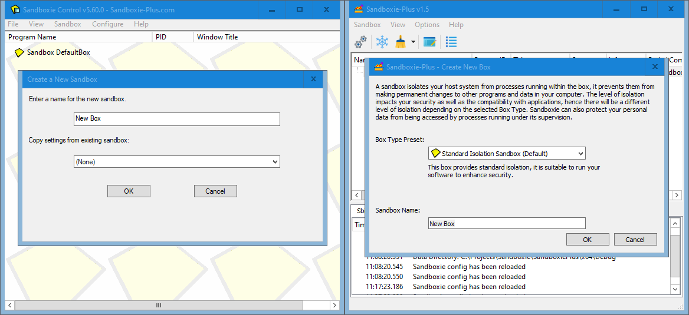

“创建新沙盒”命令会打开新沙盒对话框。与经典版不同，这里可以选择沙盒类型预设。

复制现有沙盒的功能现在位于另一个位置。（请参阅以下单元。）

## 复制沙盒配置

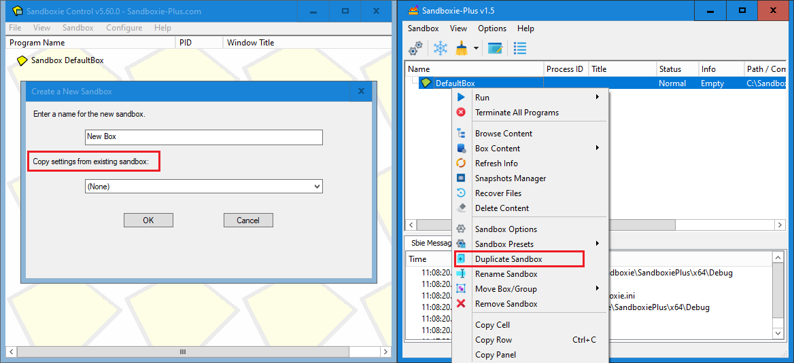

要复制现有的沙盒配置，可以使用“复制沙盒”菜单命令。

## 视图菜单

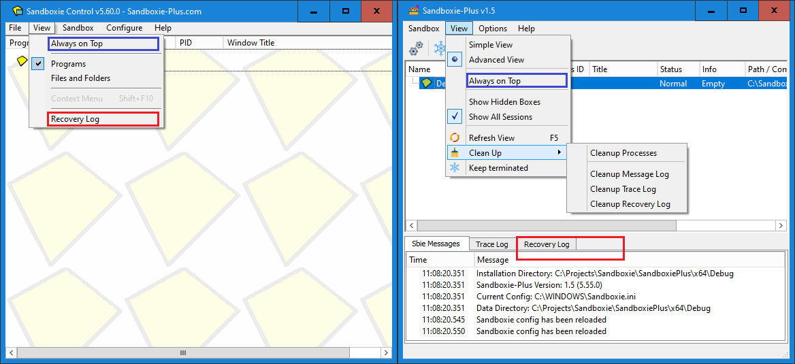

“视图”菜单提供了更多功能，以及启用简化视图模式的选项。恢复日志不再是一个单独的窗口，而是底部的一个选项卡（选择“高级视图”时可见）。

## 视图菜单 - 文件和文件夹

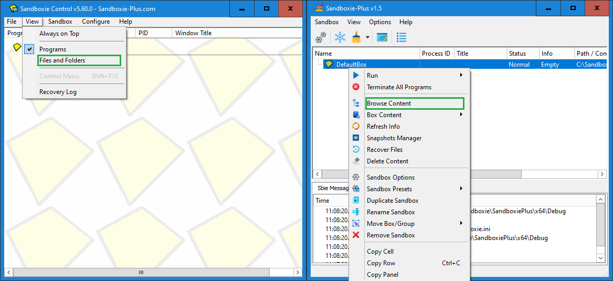

现代 Sandboxie UI 已将“文件和文件夹”视图替换为一个单独的窗口，可以从沙盒上下文菜单中打开。

## 文件和文件夹 - 视图/窗口

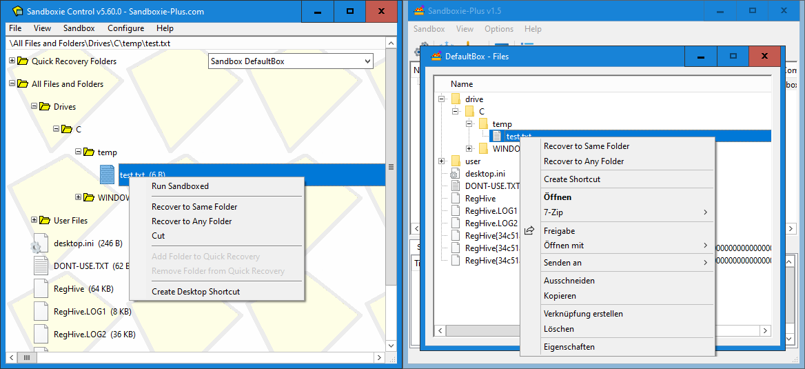

“文件”窗口提供了与旧视图相同的功能，但通过提供完整的上下文菜单进行了增强。

## 全局设置

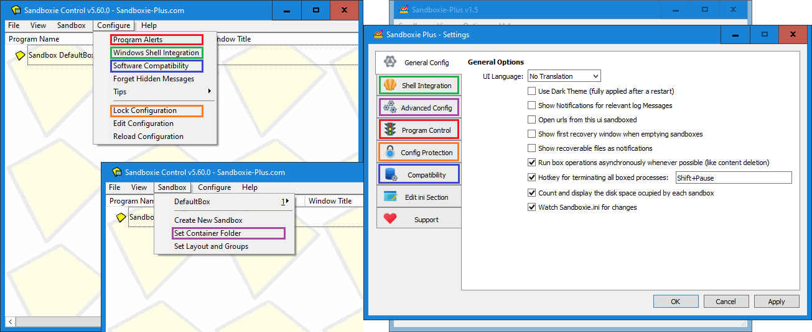

新的 Sandboxie PlusUI 有一个全局设置窗口（选项 --> 全局设置），所有选项都位于垂直选项卡上，而不必打开单独的窗口。

## 文件系统根目录

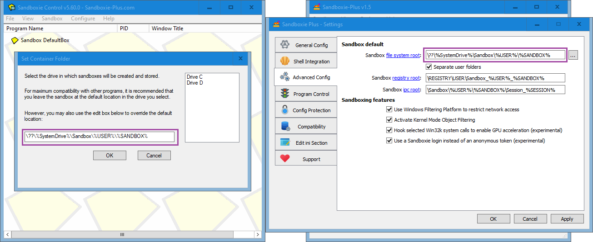

在现代 UI 中，不仅可以更改文件系统根路径，还可以更改注册表根目录和 IPC 根目录。

## 程序启动监控

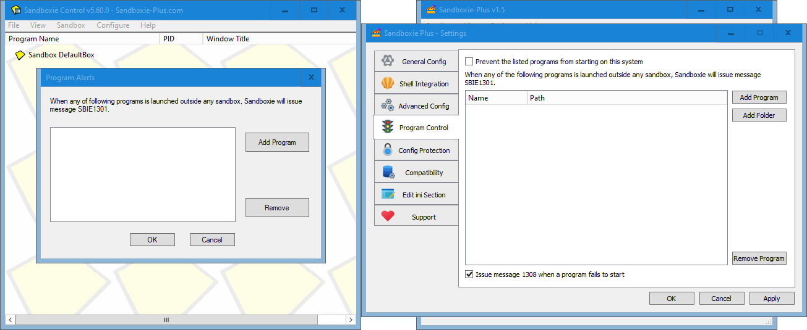

Sandboxie Plus 不仅可以在未沙盒化的进程启动时发出警告，还可以完全阻止它们启动。

## 外壳集成

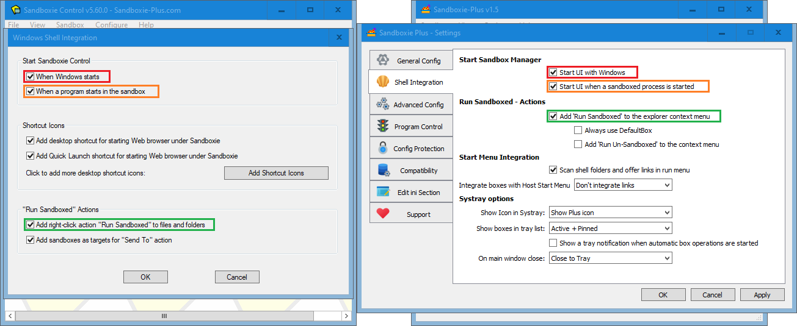

在这个选项卡上，可以配置外壳集成。大多数功能都可用，尽管一些已弃用的功能已被删除，其他选项也被移走了。

## 创建沙盒快捷方式

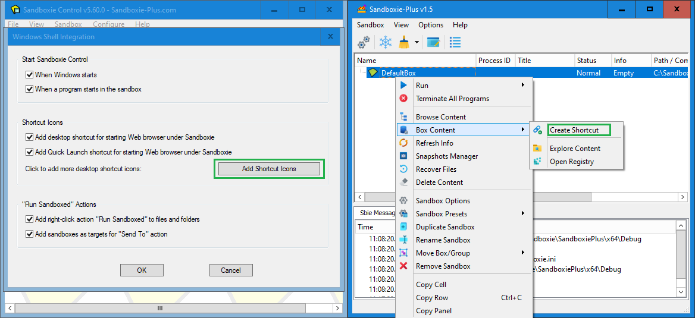

要创建沙盒化程序的快捷方式，现在可以使用沙盒上下文菜单中的一个选项，这样可以更快地访问。

## 软件兼容性

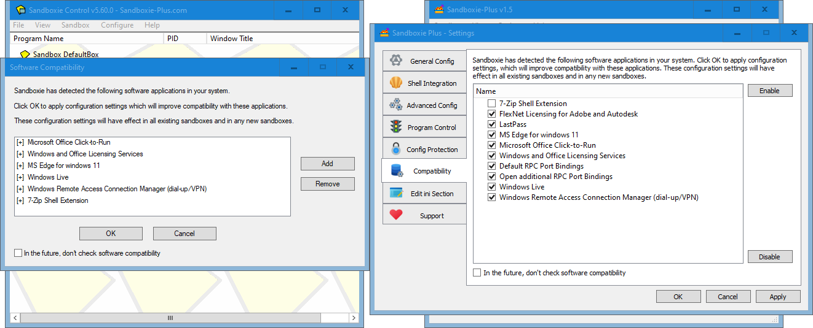

兼容性对话框现在也集成到了全局设置窗口中（“兼容性”选项卡）。

## 锁定配置

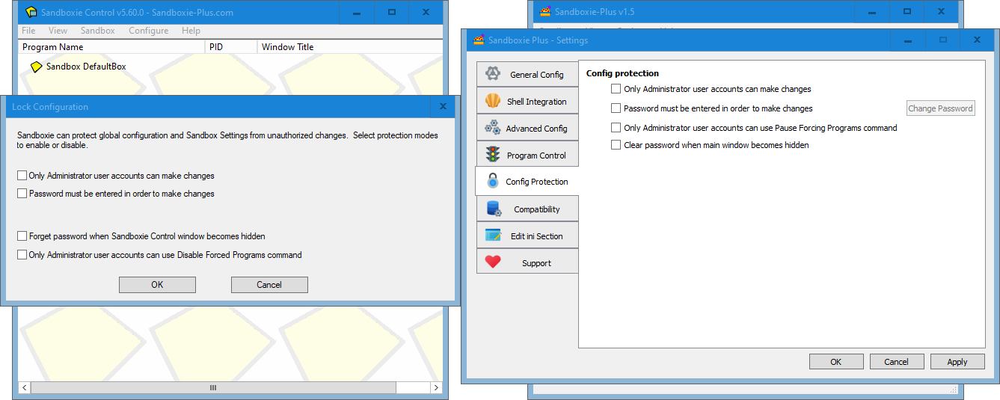

从版本 1.9.0 / 5.64.0 开始，[配置保护](ConfigurationProtection.md) 选项位于“高级配置”选项卡的子选项卡“Sandboxie.ini 预设”中。

## 沙盒上下文菜单

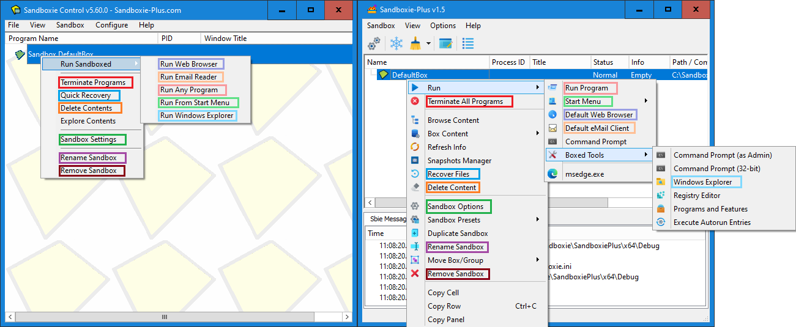

沙盒上下文菜单更加高级，包含了旧菜单中的所有选项。现在双击沙盒名称会打开沙盒设置。

## 浏览内容

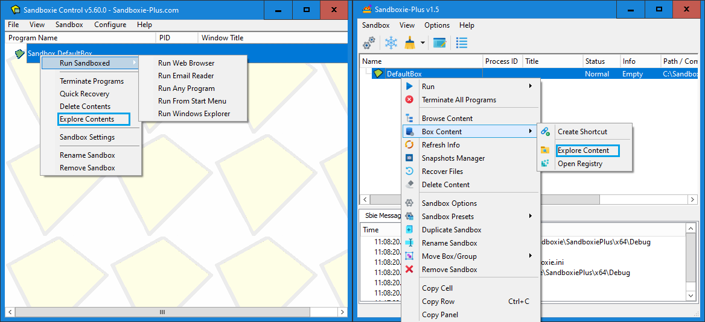

除了能够浏览内容外，“沙盒内容”子菜单还允许挂载和浏览沙盒化的注册表。

## 沙盒设置

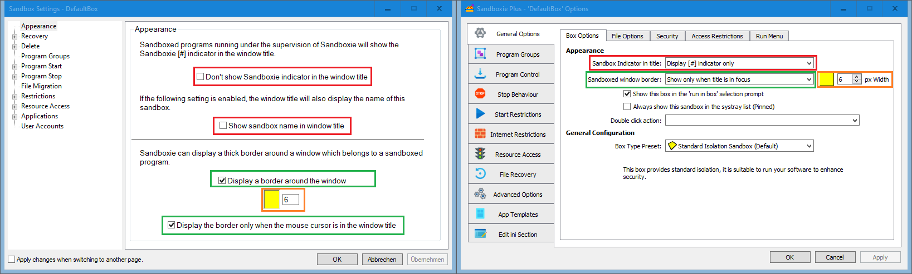

旧版沙盒设置中的所有功能现在都位于沙盒选项中。有些区域相似，但很多也被移动了。

## 快速和即时恢复

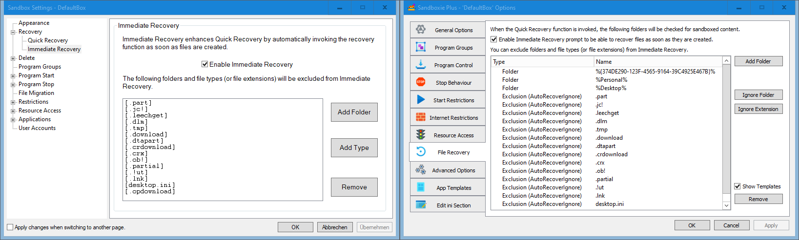

快速恢复和即时恢复选项已合并到一个选项卡中（“文件恢复”）。

## 删除选项

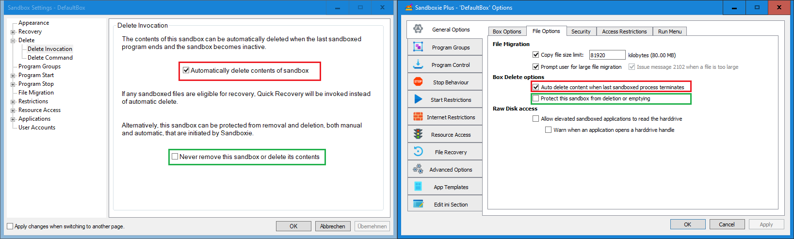

删除选项已移至“常规选项”选项卡的子选项卡“文件选项”中。

## 删除命令

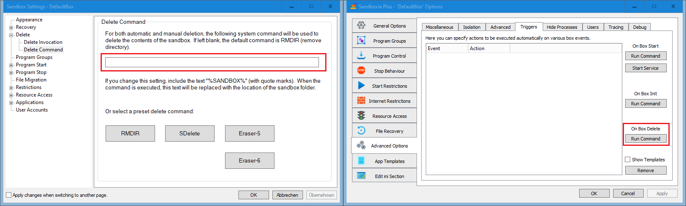

“删除命令”选项现在可以在“高级选项”选项卡的子选项卡“触发器”中找到。

## 程序组

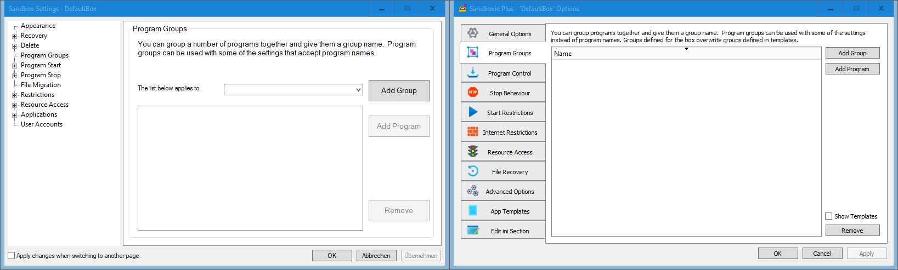

新 UI 和旧 UI 一样支持程序组。

## 强制程序和文件夹

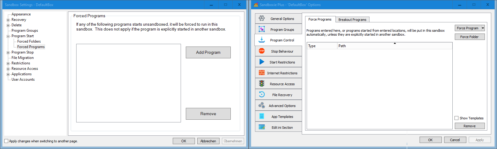

强制程序和文件夹也合并到一个选项卡中（“程序控制”，子选项卡“强制*程序”）。

## 残留程序和主程序

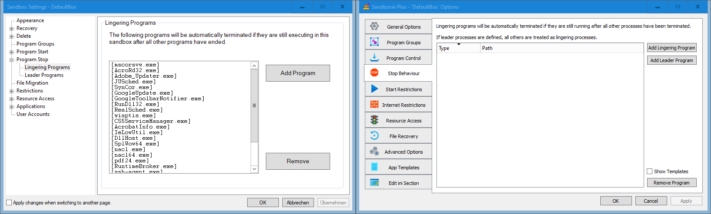

程序停止行为也合并到一个选项卡中。

## 文件迁移

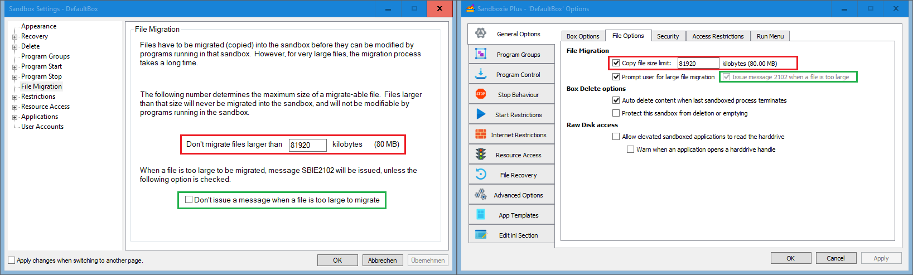

文件迁移选项已集成到“常规选项”选项卡的“文件选项”子选项卡中。

## 互联网访问

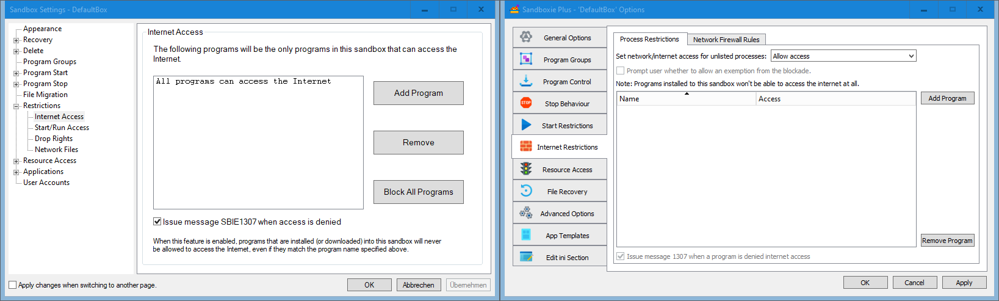

Sandboxie Plus 不仅可以使用旧的阻止互联网访问方法，还可以使用 Windows 过滤平台（WFP），这提供了更好的兼容性。

## 网络访问

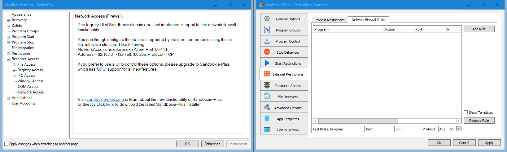

此外，使用 WFP 功能，可以为每个沙盒配置防火墙（“互联网限制”选项卡 --> 子选项卡“网络防火墙规则”）。

## 启动/运行访问

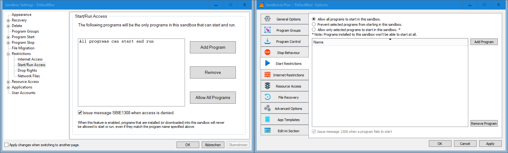

启动限制选项已提升为顶级选项卡。

## 放弃权限

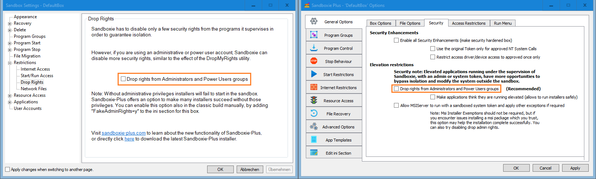

“放弃管理员权限”选项在新 UI 中位于“常规选项”选项卡的“安全”子选项卡中，同时还有其他安全增强功能。

## 网络文件

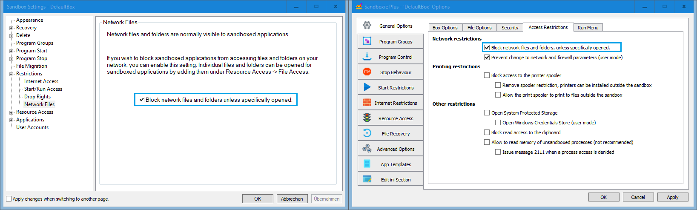

“阻止网络文件和文件夹访问”已移至“常规选项”选项卡的“访问限制”子选项卡中。

## 资源访问

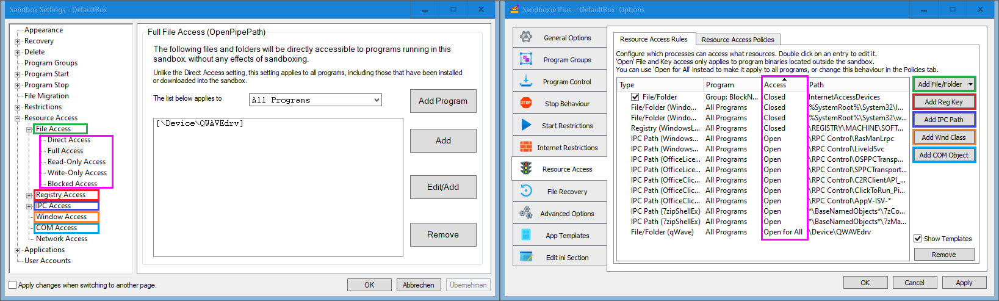

“资源访问”选项已集成到一个联合视图中，该视图在一个列表中显示所有预设，可以编辑和禁用这些选项而无需删除它们。

## 应用程序兼容性模板

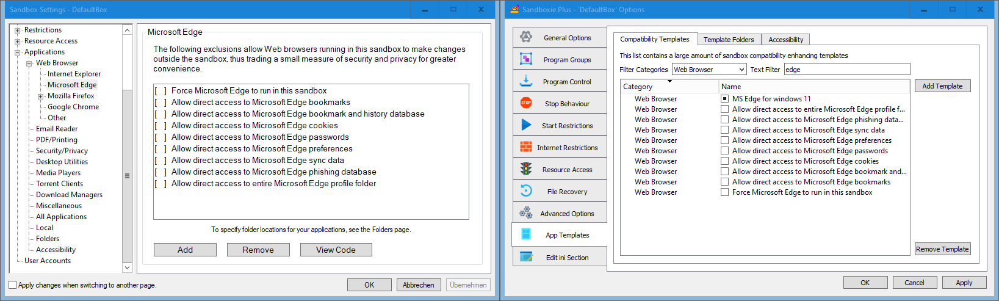

兼容性模板现在也以联合视图的形式呈现（“应用模板”选项卡，子选项卡“兼容性模板”）。

## 用户账户

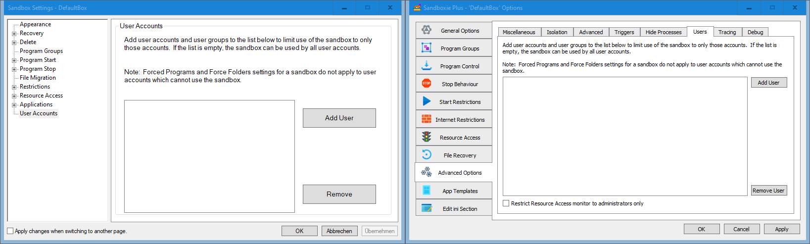

最后，将沙盒限制为选定用户的功能已移至“高级选项”选项卡的子选项卡“用户”中。

## 关于对话框

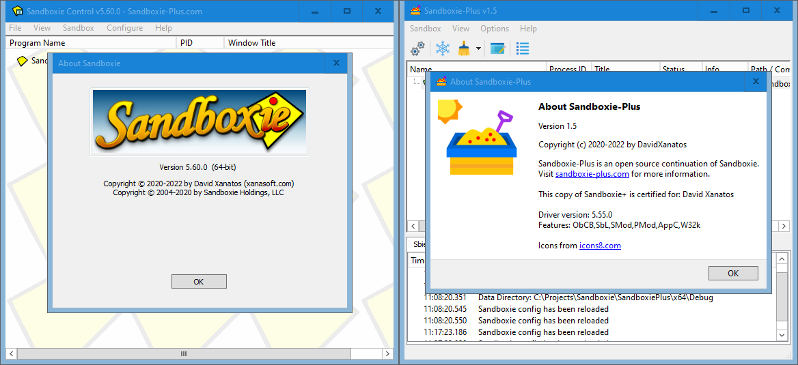

最后，我们有关于对话框。

显然，Sandboxie Plus 还有更多此处未显示的附加选项，因为本指南仅用于方便从经典版 Sandboxie 迁移到 Sandboxie Plus。