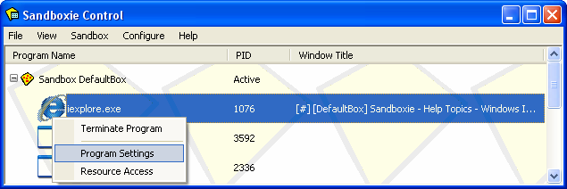
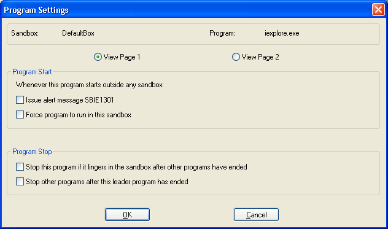
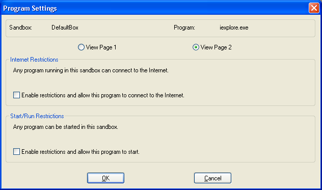

# 程序设置

### 概览

程序设置窗口是配置 Sandboxie 某些方面的一种快捷方式。要访问此窗口，右键点击正在运行的沙盒化程序的名称以显示上下文菜单，然后选择 _程序设置_：

（你也可以使用 Shift+F10 或视图菜单显示上下文菜单。）

程序设置窗口显示程序运行所在的沙盒、程序可执行文件的名称，以及用于快捷配置设置的复选框。它由两个页面组成。使用 _查看页面 1_ 和 _查看页面 2_ 单选按钮在页面之间切换。

* * *

### 页面 1

**程序启动**

这些设置控制 Sandboxie 如何处理在沙盒外启动的程序。

*   **发出警报消息 SBIE1301**
    *   每当此程序在沙盒外启动时，Sandboxie 将发出 [SBIE1301](SBIE1301.md) 消息。
    *   另请参阅[配置菜单 > 程序警报](ConfigureMenu.md#程序警报)。

*   **强制程序在此沙盒中运行**
    *   Sandboxie 将自动强制该程序在此沙盒中运行。
    *   另请参阅[沙盒设置 > 程序启动 > 强制程序](ProgramStartSettings.md#强制程序)。

**程序停止**

这些设置控制 Sandboxie 如何处理此程序在此沙盒中停止。

*   **如果此程序在其他程序结束后仍残留于沙盒中，则停止它**
    *   如果当所有其他程序都停止时此程序仍在运行，Sandboxie 将自动终止它。
    *   另请参阅[沙盒设置 > 程序停止 > 残留程序](ProgramStopSettings.md#残留程序)。

*   **在此主导程序结束后，停止其他程序**
    *   当此程序停止时，Sandboxie 将终止沙盒中的所有其他程序。
    *   另请参阅[沙盒设置 > 程序停止 > 主导程序](ProgramStopSettings.md#主导程序)。

* * *

### 页面 2

这些设置控制哪些限制适用于此程序。

**互联网限制**：

*   **启用限制并允许此程序连接互联网**
    *   在沙盒中启用互联网限制，这意味着除非被显式允许，否则任何程序都无法连接互联网。
    *   此外，还显式允许此程序从该沙盒连接互联网。
    *   另请参阅[沙盒设置 > 限制 > 互联网访问](RestrictionsSettings.md#互联网访问)。

**启动/运行限制**：

*   **启用限制并允许此程序启动**
    *   在沙盒中启用启动/运行限制，这意味着除非被显式允许，否则任何程序都无法启动。
    *   此外，还显式允许此程序在此沙盒中启动和运行。
    *   另请参阅[沙盒设置 > 限制 > 启动/运行访问](RestrictionsSettings.md#启动-运行访问)。
