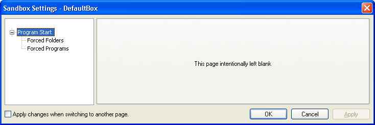
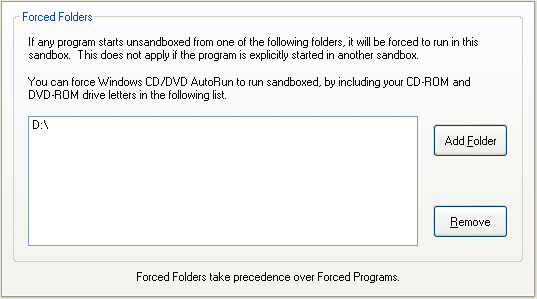
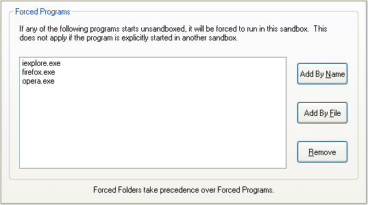

# 程序启动设置

### “程序启动”设置组

[沙盒管理器](SandboxieControl.md) > [沙盒设置](SandboxSettings.md) > 程序启动：

本节中的设置控制哪些程序在沙盒外启动时会被自动沙盒化。换句话说，在这里选择 Sandboxie 将“强制”以沙盒化方式运行的程序。

* * *

### 强制文件夹

[沙盒管理器](SandboxieControl.md) > [沙盒设置](SandboxSettings.md) > 程序启动 > 强制文件夹

你可以指定某些文件夹进行自动（或强制）沙盒化。这意味着如果该文件夹中的任何程序以非沙盒化方式启动，Sandboxie 将自动强制该程序在沙盒中运行。以下是一些有用的示例：

*   你的“下载”文件夹，你通常从互联网下载软件的地方。
*   你的 CDROM 或 DVD 驱动器，使 CD 和 DVD 上的“自动运行”程序以沙盒化方式启动。
*   如果你在单独文件夹中安装了同一程序的多个版本，并希望把每个版本隔离到单独的沙盒中。

使用此设置页选择强制文件夹应适用的文件夹（或驱动器）。

注意：

*   强制文件夹可以使用 [禁用强制程序](FileMenu.md#禁用强制程序) 命令临时暂停。

*   强制文件夹优先于 [强制程序](ProgramStartSettings.md#强制程序)。换句话说，当程序同时匹配强制文件夹和强制程序设置时，将应用强制文件夹设置，而忽略强制程序设置。

相关 [Sandboxie Ini](SandboxieIni.md) 设置项：[强制文件夹](ForceFolder.md)。

* * *

### 强制程序

[沙盒管理器](SandboxieControl.md) > [沙盒设置](SandboxSettings.md) > 程序启动 > 强制程序

你可以指定某些程序名称进行自动（或强制）沙盒化。这意味着如果该程序以非沙盒化方式启动，Sandboxie 将自动强制该程序在沙盒中运行。强制程序设置最常见的用途是把网页浏览器设置为自动沙盒化运行。

使用此设置页选择将被强制在沙盒中运行的程序。使用 _按名称添加_ 按钮输入程序名称，或用 _按文件添加_ 按钮通过文件夹导航选择程序文件。

你也可以在 [程序设置](ProgramSettings.md) 窗口中配置此设置。

*   你的“下载”文件夹，你通常从互联网下载软件的地方。
*   你的 CDROM 或 DVD 驱动器，使 CD 或 DVD 上的“自动运行”程序以沙盒化方式启动。
*   如果你在单独文件夹中安装了同一程序的多个版本，并希望把每个版本隔离到单独的沙盒中。

注意：

*   强制程序可以使用 [禁用强制程序](FileMenu.md#禁用强制程序) 命令临时暂停。

*   [强制文件夹](ProgramStartSettings.md#强制文件夹) 优先于强制程序。换句话说，当程序同时匹配强制文件夹和强制程序设置时，将应用强制文件夹设置，而忽略强制程序设置。

相关 [Sandboxie Ini](SandboxieIni.md) 设置项：[强制进程](ForceProcess.md)。
