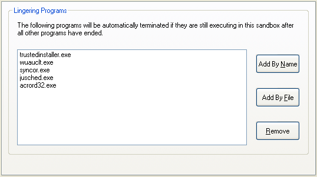

# 程序停止设置

### “程序停止”设置组

[沙盒管理器](SandboxieControl.md) > [沙盒设置](SandboxSettings.md) > 程序停止：

本节中的设置控制 Sandboxie 何时自动结束在沙盒中运行的程序。

* * *

### 残留程序

[沙盒管理器](SandboxieControl.md) > [沙盒设置](SandboxSettings.md) > 程序停止 > 残留程序

当一个沙盒化程序启动另一个程序时，那个程序会在同一个沙盒中启动。然而，第一个程序的结束并不一定意味着第二个程序也结束。这意味着在沙盒中的主要程序停止后，沙盒仍可能处于活动状态。

例如，在 Internet Explorer 中查看 PDF 文件可能导致 Adobe Acrobat Reader 程序（acrord32.exe）在沙盒中启动。即使 Internet Explorer 程序已结束，Reader 程序仍会残留在沙盒中。这种行为通常是不想要的。

使用此设置页指定：如果某些程序在其他所有（非残留）程序结束后仍残留在沙盒中，Sandboxie 应自动停止这些程序。

你也可以在 [程序设置](ProgramSettings.md) 窗口中配置此设置。

（注意：acrord32.exe 已经是默认设置。）

注意：当沙盒中没有程序运行，而你显式启动某个残留程序时，该程序不会被视作残留程序，也不会被自动停止。例如，如果沙盒中没有程序运行，而你显式以沙盒化方式启动 Adobe Acrobat Reader，Sandboxie 不会立即停止该程序。

相关 [Sandboxie Ini](SandboxieIni.md) 设置项：[驻留进程](LingerProcess.md)。

* * *

### 主导程序

[沙盒管理器](SandboxieControl.md) > [沙盒设置](SandboxSettings.md) > 程序停止 > 主导程序

当此沙盒化程序结束时，Sandboxie 将停止沙盒中的所有其他程序。

使用此设置页指定哪些程序应被视为沙盒中的主要程序，使得每当它们结束并停止时，沙盒中的所有其他程序也随之停止。

例如，如果你有一个专用于网页浏览的沙盒，与其列出所有可能的残留程序（关于残留程序的讨论见上文 [残留程序](ProgramStopSettings.md#残留程序)），不如只把网页浏览器程序列为主导程序。

你也可以在 [程序设置](ProgramSettings.md) 窗口中配置此设置。

相关 [Sandboxie Ini](SandboxieIni.md) 设置项：[引导进程](LeaderProcess.md)。
