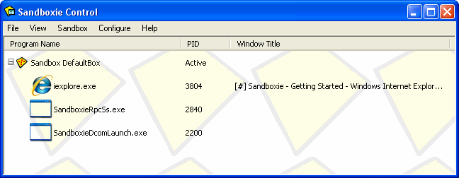

# 程序视图

[沙盒管理器](SandboxieControl.md) > [视图菜单](ViewMenu.md) > [程序](ViewMenu.md#程序)

_程序视图_ 是 [沙盒管理器](SandboxieControl.md) 中的默认视图模式。每个沙盒中运行的程序都显示在这里，按沙盒名称分组。列表显示三列：

*   _程序名称_ 列显示程序的可执行文件名。例如，图中显示 _iexplore.exe_，即 Internet Explorer 的可执行文件名。
    *   对于描述沙盒的行，此列显示沙盒名称。

*   _PID_ 列显示程序的进程 ID。这与 Windows 任务管理器“进程”选项卡中显示的数字相同。（按 Ctrl+Shift+Esc 键盘快捷键或 Ctrl+Alt+Del（会进入 Windows 登录屏幕）可打开 Windows 任务管理器。）
    *   对于描述沙盒的行，如果沙盒中有程序在运行，此列显示 _活动_。

*   _窗口标题_ 列显示与程序主窗口关联的标题。

使用每个 _活动_ 沙盒行开头的 _+_ 或 _-_ 小图标，可以展开或折叠沙盒中程序的显示。

**上下文菜单**

_程序视图_ 为沙盒和程序提供上下文菜单。要显示某行项目（沙盒或程序）的上下文菜单，请执行以下任一操作：

*   在行的任意位置点击鼠标右键。

*   用鼠标或键盘选中（高亮）该行，然后按 Shift+F10。

*   用鼠标或键盘选中（高亮）该行，然后使用 [视图菜单 > 上下文菜单](ViewMenu.md#上下文菜单) 命令。

对于沙盒行，显示的上下文菜单与 [沙盒菜单 > 沙盒子菜单](SandboxMenu.md#沙盒子菜单) 相同。完整说明参见该处。

对于程序行，上下文菜单提供以下命令：

*   _终止程序_ 命令终止该程序。

*   _程序设置_ 命令显示该程序的 [程序设置](ProgramSettings.md) 窗口。

*   _资源访问_ 命令显示 [沙盒设置 > 资源访问](ResourceAccessSettings.md) 设置页组，其中程序名称已在程序名称筛选器（_以上列表适用于_筛选器）中预选。

* * *

前往 [沙盒管理器](SandboxieControl.md)、[文件和文件夹视图](FilesAndFoldersView.md)、[帮助主题](HelpTopics.md)。
