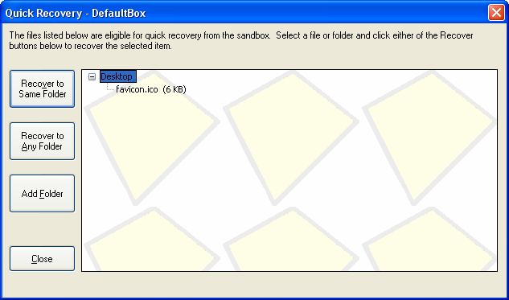

# 快速恢复

[沙盒管理器](SandboxieControl.md) > [沙盒菜单](SandboxMenu.md) > 快速恢复

[沙盒管理器](SandboxieControl.md) > [托盘图标菜单](TrayIconMenu.md) > 快速恢复

沙盒化程序会在沙盒内创建文件和文件夹。把其中一些已创建的文件移出沙盒往往是可取的。例如，沙盒化浏览器下载的文档文件会保存到沙盒中，但该文件应被取出并放到沙盒外的_文档_文件夹。

最原始的方法是使用常规（非沙盒化）的 Windows 资源管理器，在组成沙盒的各个文件夹中浏览。使用 [沙盒菜单 > 沙盒 > 浏览内容](SandboxMenu.md#沙盒菜单) 命令，可以打开一个（非沙盒化的）文件夹窗口查看沙盒内部。然后你可以在沙盒文件夹中层层深入，_剪切_沙盒中的文件以便_粘贴_到其他位置。

快速恢复功能让提取沙盒化程序创建并保存的文件（甚至整个文件夹）变得更容易。它会扫描预先选定的一些沙盒文件夹，列出在其中找到的文件（和文件夹）。这些文件（和文件夹）可以被恢复到沙盒外的对应位置，或任意位置。

要打开快速恢复窗口，使用 [沙盒菜单 > 沙盒 > 快速恢复](SandboxMenu.md#沙盒菜单) 命令（或 [托盘图标菜单](TrayIconMenu.md) 中的相应命令）。快速恢复也会作为 [删除沙盒](DeleteSandbox.md) 窗口的一部分出现。

**快速恢复窗口**

窗口中央延伸至右下角的区域，显示某个特定沙盒中可快速恢复的文件和文件夹。选择文件或文件夹，然后点击左侧两个 _恢复到_ 按钮之一：

*   _恢复到相同文件夹_ 把文件（或文件夹）从沙盒移动到沙盒外的对应位置。例如，上图显示文件 _favicon.ico_ 位于沙盒化的_桌面_文件夹中。对该文件点击此命令会把它移动到真实的桌面文件夹。
*   _恢复到任意文件夹_ 先显示一个 _浏览文件夹_ 对话框，然后把文件（或文件夹）移动到对话框中选定的文件夹。

你也可以对文件或文件夹调用上下文菜单（通常通过右键点击）来使用这些命令。

**向快速恢复添加文件夹**

如前所述，快速恢复只扫描显式选定的文件夹。默认扫描_桌面_、_收藏夹_和_文档_文件夹。在适用情况下，_下载_文件夹也被视为可恢复文件夹。

*   你可以用 _添加文件夹_ 按钮添加更多文件夹。
*   你可以用 [沙盒设置 > 恢复 > 快速恢复](RecoverySettings.md#快速恢复) 添加和移除文件夹。
*   当 [沙盒管理器](SandboxieControl.md) 处于 [文件和文件夹视图](FilesAndFoldersView.md) 时，你可以右键点击文件夹并选择 _将文件夹添加到快速恢复_。

* * *

前往 [删除沙盒](DeleteSandbox.md)、[即时恢复](ImmediateRecovery.md)、[沙盒管理器](SandboxieControl.md)、[帮助主题](HelpTopics.md)。
