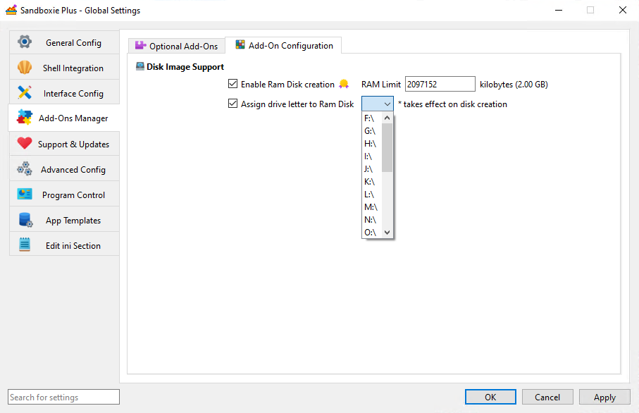

# 内存虚拟磁盘盘符

_RamDiskLetter_ 是 [Sandboxie Ini](SandboxieIni.md) 中的一项全局设置（v1.11.1 / 5.66.1 引入），指定要分配给内存虚拟磁盘的盘符，该虚拟磁盘供启用了 [使用内存虚拟磁盘](UseRamDisk.md) 设置的沙盒使用。此设置允许用户定义特定盘符，以便更容易访问内存虚拟磁盘。

## 用法

要设置 `RamDiskLetter`，请在 Sandboxie 配置文件的 `[GlobalSettings]` 节下添加以下行：

```ini
[GlobalSettings]

# 示例：为内存虚拟磁盘分配盘符 R
RamDiskLetter=R:\
```

## 沙盒管理器图形界面

可以通过以下步骤选择内存虚拟磁盘盘符设置：

1. 在沙盒管理器界面中打开`全局设置`窗口。
2. 导航到`附加组件管理器` > `附加组件配置`选项卡。
3. 启用`为内存虚拟磁盘分配盘符`设置，并为内存虚拟磁盘选择一个盘符。

    

## 重要说明

- **单一盘符**：只能为内存虚拟磁盘分配一个盘符，它将用于所有使用内存虚拟磁盘功能的沙盒。

- **可用盘符**：确保指定的盘符未被系统上的另一个驱动器或分区占用。如果盘符已被分配，内存虚拟磁盘可能无法挂载并记录错误。

- **配置要求**：应在各个沙盒中启用 `UseRamDisk` 之前配置 `RamDiskLetter` 设置，以确保正确分配。

## 性能考虑

- **易于访问**：为内存虚拟磁盘分配特定盘符可以简化应用程序和用户的访问，使在文件路径中引用内存虚拟磁盘更容易。

## 相关设置

- [内存虚拟磁盘大小 (KB)](RamDiskSizeKb.md) - 指定内存虚拟磁盘的大小。
- [使用内存虚拟磁盘](UseRamDisk.md) - 为单个沙盒启用内存虚拟磁盘的使用。

通过配置 `RamDiskLetter` 设置，用户可以为内存虚拟磁盘提供一致且易于访问的盘符，从而增强他们的 Sandboxie 体验。
