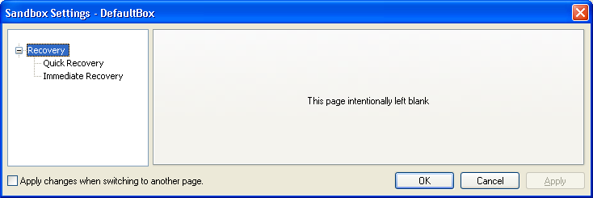
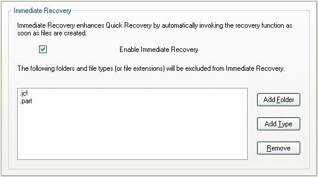

# 恢复设置

### “恢复”设置组

[沙盒管理器](SandboxieControl.md) > [沙盒设置](SandboxSettings.md) > 恢复：

虽然你可以手动浏览沙盒内容并提取需要的文件，但 Sandboxie 有一个 [快速恢复](QuickRecovery.md) 工具，它会扫描特定文件夹，并告知你是否有哪些文件可以从沙盒中恢复。恢复组配置此工具。

* * *

### 快速恢复

[沙盒管理器](SandboxieControl.md) > [沙盒设置](SandboxSettings.md) > 恢复 > 快速恢复：

使用此设置页添加和移除应由 Sandboxie 扫描的文件夹。

你也可以间接影响此设置：

*   在 [文件和文件夹视图](FilesAndFoldersView.md) 中，右键点击_文件夹_项并调用 _将文件夹添加到快速恢复_ 或 _从快速恢复中移除文件夹_ 操作。

*   在 [删除沙盒](DeleteSandbox.md) 或 [快速恢复](QuickRecovery.md) 窗口中，点击 _添加文件夹_ 按钮。

相关 [Sandboxie Ini](SandboxieIni.md) 设置项：[恢复文件夹](RecoverFolder.md)。

* * *

### 即时恢复

[沙盒管理器](SandboxieControl.md) > [沙盒设置](SandboxSettings.md) > 恢复 > 即时恢复：

快速恢复工具只在被调用时扫描文件夹——要么显式调用，要么在沙盒即将被删除时。[即时恢复](ImmediateRecovery.md) 是一个扩展，一旦沙盒化程序创建了可恢复文件，它就会立即通知你。

此行为通常很有用，默认启用，但如果需要也可以禁用。

也可能希望保持即时恢复启用，同时排除某些文件类型。例如：你可能希望收到保存到（沙盒化的）桌面的文档文件的通知，但不希望收到沙盒化程序安装期间可能在桌面创建的快捷方式（_.LNK_）文件的通知。

使用此设置页启用或禁用即时恢复扩展，并配置即时恢复的排除项。

相关 [Sandboxie Ini](SandboxieIni.md) 设置项：[自动恢复](AutoRecover.md)、[自动恢复忽略](AutoRecoverIgnore.md)。
