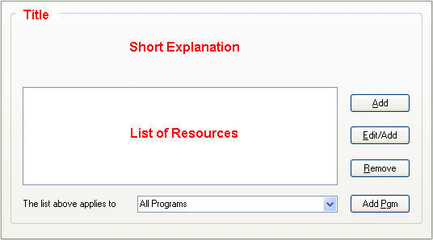

# 资源访问设置

### “资源访问”设置组

[沙盘控制面板](SandboxieControl.md) > [沙箱设置](SandboxSettings.md) > 资源访问

在沙箱中运行的程序通常不允许直接访问系统资源。在某些情况下，可能需要对这一规则进行例外处理。此处的设置用于显示和更改这些例外规则。

例外处理方便或必要的示例如下：

* 允许直接访问某些特定文件夹。例如，让网络浏览器将下载内容直接放置在 _Downloads_ 文件夹中。 
  请参阅下面的[文件访问](ResourceAccessSettings.md#文件访问)类别。
* 某个程序可能需要访问某些资源才能正常运行。如果该程序是已知且受信任的，那么进行这样的例外处理是合理的。有关示例，请参阅[已知冲突](KnownConflicts.md)。

配置更改不会应用于在配置更改时已经在沙箱中运行的程序。为了简化操作，建议在沙箱中没有程序运行时进行配置更改。

* * *

### 一般信息

“资源访问”组中的每个设置页面通常具有以下特点：

* 页面有一个 _标题_，例如 _直接文件访问_ 或 _只读注册表访问_。
* 有一个 _简短说明_，描述该设置的作用。
* 有一个 _资源列表_，显示获得特殊处理的资源。
  * 根据具体设置的不同，这可能意味着这些资源对沙箱中的程序完全可访问。
  * 或者意味着这些资源完全不可访问。
  * _简短说明_ 简要描述了这些资源与访问它们的程序之间的关系。
  * 你还应该查阅下面针对具体设置的文档，以全面了解其含义。
  * 列表中的资源可能仅适用于某个特定程序。不过，一般来说，它们适用于 _所有程序_。
* 有一个 _添加_ 按钮，用于向列表中添加新的资源条目。
* 有一个 _编辑/添加_（有时仅为 _编辑_）按钮，用于编辑列表中的资源条目，或向列表中添加新的资源条目。
* 有一个 _移除_ 按钮，用于从列表中移除资源条目。
* 有一个标有 _上面的列表适用于_ 的列表框。此列表框将资源与特定程序关联起来。
  * 默认情况下，资源适用于 _所有程序_，如上面的示例所示。
  * 你可以通过从列表框中选择特定程序，将资源应用于该程序。
  * 你也可以直接在列表框中输入特定程序的名称。
  * 你还可以使用 _添加程序_ 按钮，通过导航到程序所在文件夹来选择特定程序。

* * *

### 文件访问

[沙盘控制面板](SandboxieControl.md) > [沙箱设置](SandboxSettings.md) > 资源访问 > 文件访问

此类别管理以下类型的资源：文件、文件夹、驱动器和其他设备。

有关编辑资源以及将资源与特定程序关联的更多信息，请参阅上面的[一般信息](ResourceAccessSettings.md#一般信息)。

#### 文件访问 > 直接访问

允许直接访问某些文件或文件夹，绕过沙盘的监管。例如，如果你添加了一个文件夹 **C:\Downloads**，那么在沙箱中运行的程序将能够在该文件夹中创建或更新文件。

请注意，当程序本身位于沙箱中时，_直接访问_ 例外情况不适用。例如，假设你允许直接访问 **C:\Downloads** 文件夹，然后你在沙箱中安装了一个新的网络浏览器。这个新的沙箱浏览器将 _无法_ 直接访问 **C:\Downloads** 文件夹。

相关的[沙盘配置文件](SandboxieIni.md)设置：[打开文件路径](OpenFilePath.md)

#### 文件访问 > 完全访问

与 _直接访问_ 类似，但即使沙箱中的程序本身位于沙箱中，也始终适用。为了更好地保护系统，建议尽可能使用 _直接访问_ 而不是 _完全访问_。

相关的[沙盘配置文件](SandboxieIni.md)设置：[打开管道路径](OpenPipePath.md)

#### 文件访问 > 只读访问

此访问模式排除了沙箱对文件（或文件夹）资源的影响，同时允许程序读取但不能修改实际资源。

相关的[沙盘配置文件](SandboxieIni.md)设置：[读取文件路径](ReadFilePath.md)

#### 文件访问 > 只写访问

此访问模式隐藏了沙箱外所选文件夹中的所有文件和文件夹。但是，沙箱中的程序可以在沙箱中对应的文件夹中创建新文件。

此设置仅适用于文件夹。如果选择了文件，其效果与“阻止访问”设置相同（见下文）。

相关的[沙盘配置文件](SandboxieIni.md)设置：[写文件路径](WriteFilePath.md)

#### 文件访问 > 阻止访问

拒绝所有对资源的访问，例如包含敏感数据的文件夹。_阻止访问_ 设置优先于所有其他资源访问规则。例如，如果 **C:\Downloads** 文件夹在 _直接访问_ 和 _阻止访问_ 中都有例外设置，那么后者将生效，拒绝所有对该文件夹的访问。

相关的[沙盘配置文件](SandboxieIni.md)设置：[关闭文件路径](ClosedFilePath.md)

* * *

### 注册表访问

[沙盘控制面板](SandboxieControl.md) > [沙箱设置](SandboxSettings.md) > 资源访问 > 注册表访问

此类别管理注册表项资源。注册表是 Windows 提供的一种机制，用于程序存储配置和设置。

有关编辑资源以及将资源与特定程序关联的更多信息，请参阅上面的[一般信息](ResourceAccessSettings.md#一般信息)。

#### 注册表访问 > 直接访问

允许直接访问注册表项资源。请注意，当程序本身位于沙箱中时，_直接访问_ 例外情况不适用。这在上面的“文件访问”类别中有更详细的描述。请注意，与“文件访问”类别不同，注册表项没有 _完全访问_ 模式。

相关的[沙盘配置文件](SandboxieIni.md)设置：[打开注册表项路径](OpenKeyPath.md)

#### 注册表访问 > 只读访问

此访问模式排除了沙箱对注册表项资源的影响，同时允许程序读取但不能修改实际资源。

相关的[沙盘配置文件](SandboxieIni.md)设置：[读取注册表项路径](ReadKeyPath.md)

#### 注册表访问 > 只写访问

此访问模式隐藏了沙箱外所选注册表项中的所有注册表数据。但是，沙箱中的程序可以在沙箱中对应的文件夹中创建新的注册表数据。

相关的[沙盘配置文件](SandboxieIni.md)设置：[写注册表项路径](WriteKeyPath.md)

#### 注册表访问 > 阻止访问

拒绝所有对注册表项资源的访问，例如包含 Windows 策略设置的注册表项。_阻止访问_ 设置优先于所有其他资源访问规则。例如，如果一个注册表项在 _直接访问_ 和 _阻止访问_ 中都有例外设置，那么后者将生效，拒绝所有对该注册表项的访问。

相关的[沙盘配置文件](SandboxieIni.md)设置：[关闭注册表项路径](ClosedKeyPath.md)

* * *

### IPC 访问

[沙盘控制面板](SandboxieControl.md) > [沙箱设置](SandboxSettings.md) > 资源访问 > IPC 访问

此类别管理 NT IPC 对象的例外情况。这些资源是系统中运行的程序为了协调操作或进行其他通信而创建的。

有关编辑资源以及将资源与特定程序关联的更多信息，请参阅上面的[一般信息](ResourceAccessSettings.md#一般信息)。

#### IPC 访问 > 直接访问

允许直接访问 IPC 对象资源。请注意，与“文件访问”和“注册表访问”类别不同，IPC 对象的 _直接访问_ 例外情况始终适用于所有沙箱中的程序。

相关的[沙盘配置文件](SandboxieIni.md)设置：[打开 IPC 路径](OpenIpcPath.md)

#### IPC 访问 > 阻止访问

拒绝所有对 IPC 对象资源的访问。_阻止访问_ 设置优先于所有其他资源访问规则。例如，如果一个 IPC 对象在 _直接访问_ 和 _阻止访问_ 中都有例外设置，那么后者将生效，拒绝所有对该对象的访问。

此设置可用于覆盖沙盘默认的 _IPC 访问 > 直接访问_ 设置，并阻止访问。例如，默认情况下，沙盘允许沙箱中的程序访问音频设备。要覆盖此设置并切断沙箱中程序的音频输出，请添加一个针对 **\RPC Control\AudioSrv** 的例外设置。

相关的[沙盘配置文件](SandboxieIni.md)设置：[关闭 IPC 路径](ClosedIpcPath.md)

* * *

### 窗口访问

[沙盘控制面板](SandboxieControl.md) > [沙箱设置](SandboxSettings.md) > 资源访问 > 窗口访问

此类别管理窗口类的例外情况。这些资源主要与屏幕上显示的窗口相关，但也可以被程序用作协调操作或进行其他通信的方式。你可以指定哪些在沙箱外创建的窗口类可供沙箱中的程序使用。

有关编辑资源以及将资源与特定程序关联的更多信息，请参阅上面的[一般信息](ResourceAccessSettings.md#一般信息)。

相关的[沙盘配置文件](SandboxieIni.md)设置：[打开窗口类](OpenWinClass.md)

* * *

### COM 访问

[沙盘控制面板](SandboxieControl.md) > [沙箱设置](SandboxSettings.md) > 资源访问 > COM 访问

此类别管理 COM 类的例外情况。这些资源代表用于协调操作或进行其他通信的对象。你可以指定那些存在于沙箱外且应可供沙箱中的程序访问的 COM 对象的 COM 类标识符。

有关编辑资源以及将资源与特定程序关联的更多信息，请参阅上面的[一般信息](ResourceAccessSettings.md#一般信息)。

相关的[沙盘配置文件](SandboxieIni.md)设置：[打开 CLSID(OpenClsid.md)
