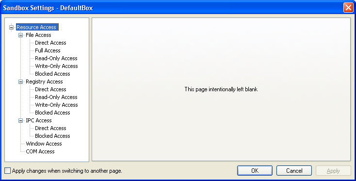
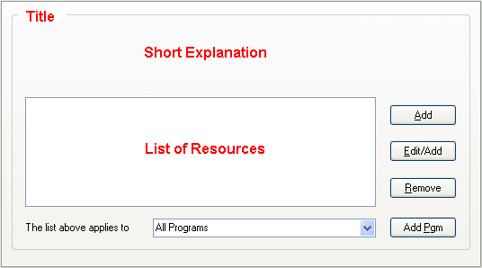

# 资源访问设置

### “资源访问”设置组

[沙盒管理器](SandboxieControl.md) > [沙盒设置](SandboxSettings.md) > 资源访问

在沙盒中运行的程序通常不允许直接访问系统资源。在某些情况下，可能希望对此规则做出例外。这里的设置显示并更改这组例外。

例外方便或必要的一些示例：

*   允许直接访问某个特定文件夹。例如，让网页浏览器把下载内容直接放到 _下载_ 文件夹中。 
    参见下面的[文件访问](ResourceAccessSettings.md#文件访问)类别。
*   程序可能需要访问某个资源才能正常运行。如果该程序已知且可信，做出这样的例外是合理的。参见 [已知冲突](KnownConflicts.md) 中的一些示例。

配置更改不适用于在更改配置时已在沙盒中运行的程序。为简单起见，建议在没有程序在沙盒中运行时进行配置更改。

* * *

### 一般信息

资源访问组中的每个设置页通常具有以下特征：

*   页面有一个_标题_，例如 _直接文件访问_ 或 _只读注册表访问_。
*   有一个_简短说明_描述该设置的作用。

*   有一个_资源列表_，显示获得特殊处理的资源。
    *   取决于特定设置，这可能意味着沙盒化程序可以完全访问这些资源。
    *   或者也可能意味着这些资源完全不可访问。
    *   _简短说明_简要描述这些资源与访问它们的程序之间的关系。
    *   你还应查阅下面针对特定设置的文档，以充分理解其含义。
    *   列表中的资源可能仅适用于特定程序。但通常它们适用于_所有程序_。

*   有一个_添加_按钮，向列表添加新的资源条目。
*   有一个_编辑/添加_（有时只是_编辑_）按钮，编辑列表中的资源条目，或向列表添加新的资源条目。
*   有一个_移除_按钮，从列表移除资源条目。

*   有一个标签为 _以上列表适用于_ 的列表框。此列表框将资源与特定程序关联。
    *   默认情况下，资源适用于_所有程序_，如上例所示。
    *   你可以通过从列表框中选择特定程序，让资源适用于该特定程序。
    *   你也可以直接在列表框中输入特定程序的名称。
    *   你还可以使用 _添加程序_ 按钮，通过浏览到程序文件夹来选择特定程序。

* * *

### 文件访问

[沙盒管理器](SandboxieControl.md) > [沙盒设置](SandboxSettings.md) > 资源访问 > 文件访问

此类别管理以下类型的资源：文件、文件夹、驱动器和其他设备。

关于编辑资源以及将资源与特定程序关联的更多信息，请参阅上面的 [一般信息](ResourceAccessSettings.md#一般信息)。

#### 文件访问 > 直接访问

允许直接访问某个文件或文件夹，绕过 Sandboxie 的监管。例如，如果添加文件夹 **C:\Downloads**，那么在 Sandboxie 下运行的程序将能够在该文件夹中创建或更新文件。

注意：当程序本身位于沙盒中时，_直接访问_ 例外不适用。例如，假设你允许直接访问 **C:\Downloads** 文件夹，然后继续向沙盒中安装一个新的网页浏览器。这个新的沙盒化浏览器将_无法_直接访问 **C:\Downloads** 文件夹。

相关 [Sandboxie Ini](SandboxieIni.md) 设置项：[开放文件路径](OpenFilePath.md)

#### 文件访问 > 完全访问

与 _直接访问_ 类似，但始终适用，即使沙盒化程序本身位于沙盒中。为获得更好的保护，建议只要可能就使用 _直接访问_ 而非 _完全访问_。

相关 [Sandboxie Ini](SandboxieIni.md) 设置项：[开放管道路径](OpenPipePath.md)

#### 文件访问 > 只读访问

此访问模式排除沙盒化对文件（或文件夹）资源的影响，同时允许程序读取（但不能修改）真实资源。

相关 [Sandboxie Ini](SandboxieIni.md) 设置项：[只读文件路径](ReadFilePath.md)

#### 文件访问 > 只写访问

此访问模式隐藏所选文件夹中位于沙盒外的所有文件和文件夹。但是，沙盒中的程序可以在沙盒内相应文件夹中创建新文件。

此设置只能有效地用于文件夹。如果选择文件，效果与阻止访问设置相同（见下文）。

相关 [Sandboxie Ini](SandboxieIni.md) 设置项：[只写文件路径](WriteFilePath.md)

#### 文件访问 > 阻止访问

拒绝对该资源的所有访问，例如对包含敏感数据的文件夹。_阻止访问_ 设置优先于所有其他资源访问规则。例如，如果 **C:\Downloads** 的例外同时出现在 _直接访问_ 和 _阻止访问_ 中，将应用后者，拒绝对该文件夹的所有访问。

相关 [Sandboxie Ini](SandboxieIni.md) 设置项：[封闭文件路径](ClosedFilePath.md)

* * *

### 注册表访问

[沙盒管理器](SandboxieControl.md) > [沙盒设置](SandboxSettings.md) > 资源访问 > 注册表访问

此类别管理注册表项资源。注册表是 Windows 提供的一种机制，供程序存储配置和设置。

关于编辑资源以及将资源与特定程序关联的更多信息，请参阅上面的 [一般信息](ResourceAccessSettings.md#一般信息)。

#### 注册表访问 > 直接访问

允许直接访问注册表项资源。注意：当程序本身位于沙盒中时，_直接访问_ 例外不适用。这在上面的文件访问类别中有更详细的描述。另请注意，与文件访问类别不同，注册表项没有 _完全访问_ 访问模式。

相关 [Sandboxie Ini](SandboxieIni.md) 设置项：[开放注册表路径](OpenKeyPath.md)

#### 注册表访问 > 只读访问

此访问模式排除沙盒化对注册表项资源的影响，同时允许程序读取（但不能修改）真实资源。

相关 [Sandboxie Ini](SandboxieIni.md) 设置项：[读取注册表项路径](ReadKeyPath.md)

#### 注册表访问 > 只写访问

此访问模式隐藏所选注册表项中位于沙盒外的所有注册表数据。但是，沙盒中的程序可以在沙盒内相应位置创建新的注册表数据。

相关 [Sandboxie Ini](SandboxieIni.md) 设置项：[写入注册表项路径](WriteKeyPath.md)

#### 注册表访问 > 阻止访问

拒绝对该注册表项资源的所有访问，例如对包含 Windows 策略设置的项。_阻止访问_ 设置优先于所有其他资源访问规则。例如，如果注册表项的例外同时出现在 _直接访问_ 和 _阻止访问_ 中，将应用后者，拒绝对该注册表项的所有访问。

相关 [Sandboxie Ini](SandboxieIni.md) 设置项：[封禁注册表项路径](ClosedKeyPath.md)

* * *

### IPC 访问

[沙盒管理器](SandboxieControl.md) > [沙盒设置](SandboxSettings.md) > 资源访问 > IPC 访问

此类别管理对 NT IPC 对象的例外。这些资源由系统中运行的程序创建，作为协调操作或以其他方式通信的手段。

关于编辑资源以及将资源与特定程序关联的更多信息，请参阅上面的 [一般信息](ResourceAccessSettings.md#一般信息)。

#### IPC 访问 > 直接访问

允许直接访问 IPC 对象资源。注意：与文件访问和注册表访问类别不同，IPC 对象的 _直接访问_ 例外始终适用于所有沙盒化程序。

相关 [Sandboxie Ini](SandboxieIni.md) 设置项：[开放 IPC 路径](OpenIpcPath.md)

#### IPC 访问 > 阻止访问

拒绝对该 IPC 对象资源的所有访问。_阻止访问_ 设置优先于所有其他资源访问规则。例如，如果 IPC 对象的例外同时出现在 _直接访问_ 和 _阻止访问_ 中，将应用后者，拒绝对该对象的所有访问。

此设置可用于覆盖 Sandboxie 中默认的 _IPC 访问 > 直接访问_ 设置并阻止访问。例如，默认情况下 Sandboxie 允许沙盒化程序访问音频设备。要覆盖此行为并切断沙盒化程序的音频输出，请为 **\RPC Control\AudioSrv** 添加例外。

相关 [Sandboxie Ini](SandboxieIni.md) 设置项：[封禁 IPC 路径](ClosedIpcPath.md)

* * *

### 窗口访问

[沙盒管理器](SandboxieControl.md) > [沙盒设置](SandboxSettings.md) > 资源访问 > 窗口访问

此类别管理对窗口类的例外。这些资源主要与屏幕上显示的窗口相关，但程序也可以把它们用作协调操作或以其他方式通信的手段。你可以指定在沙盒外创建的哪些窗口类可供沙盒化程序使用。

关于编辑资源以及将资源与特定程序关联的更多信息，请参阅上面的 [一般信息](ResourceAccessSettings.md#一般信息)。

相关 [Sandboxie Ini](SandboxieIni.md) 设置项：[开放窗口类](OpenWinClass.md)

* * *

### COM 访问

[沙盒管理器](SandboxieControl.md) > [沙盒设置](SandboxSettings.md) > 资源访问 > COM 访问

此类别管理对 COM 类的例外。这些资源代表用作协调操作或以其他方式通信手段的对象。你可以指定存在于沙盒外的 COM 对象的 COM 类标识符，这些对象应可供沙盒化程序访问。

关于编辑资源以及将资源与特定程序关联的更多信息，请参阅上面的 [一般信息](ResourceAccessSettings.md#一般信息)。

相关 [Sandboxie Ini](SandboxieIni.md) 设置项：[开放 Clsid](OpenClsid.md)
