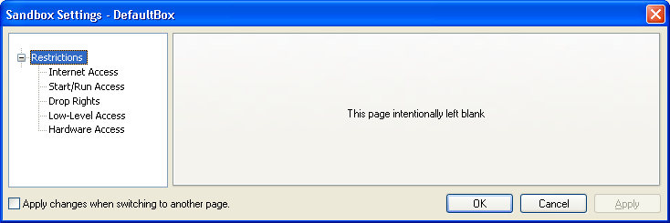
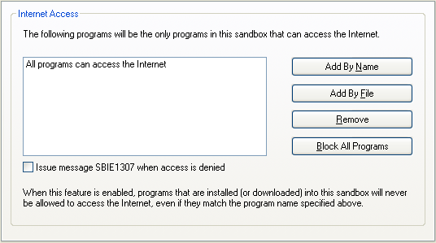
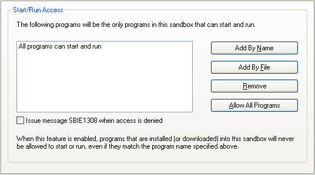
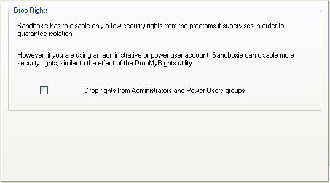
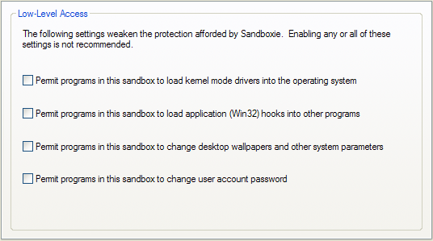
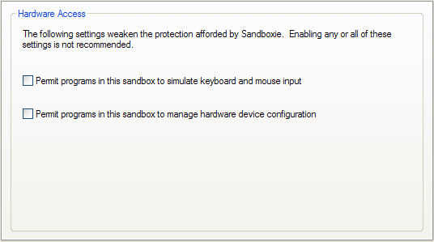

# 限制设置

### “限制”设置组

[沙盒管理器](SandboxieControl.md) > [沙盒设置](SandboxSettings.md) > 限制

本节中的设置旨在更改 Sandboxie 对沙盒中运行的程序施加的默认限制集。

*   你可以对程序施加额外限制，以加强沙盒的安全性。
*   你可以放宽某些默认限制——通常不建议这样做，但可能使某些特殊的程序得以运行。

* * *

### 互联网访问

[沙盒管理器](SandboxieControl.md) > [沙盒设置](SandboxSettings.md) > 限制 > 互联网访问

使用这些设置选择沙盒中哪些程序（如果有）将被允许访问互联网。最初，沙盒中的所有程序都可以访问互联网。

使用 _按名称添加_ 按钮，通过输入明确的可执行文件名来添加程序。或者使用 _按文件添加_ 按钮，浏览到程序文件夹并选择其程序可执行文件。~~你还可以通过访问 [阻止端口](BlockPort.md) 来阻止 SMB/CIFS。~~

当_任何_限制生效时，安装（或下载）到沙盒中的程序将永远不会被允许访问互联网。

使用 _移除_ 按钮移除之前添加到列表中的某个程序。

_阻止所有程序_ 按钮阻止沙盒中的所有程序访问互联网。当此模式生效时，按钮会变为 _允许所有程序_，点击它将撤销阻止所有程序的效果。

_访问被拒绝时发出消息 [SBIE1307](SBIE1307.md)_：当程序因该设置而受到限制时，Sandboxie 可以发出通知消息。使用此复选框设置指示你是否希望接收这些通知。另请参阅消息 [SBIE1307](SBIE1307.md)。

你也可以在 [程序设置](ProgramSettings.md) 窗口中配置此设置。

相关 [Sandboxie Ini](SandboxieIni.md) 设置项：[封闭文件路径](ClosedFilePath.md)、[Notify Internet Access Denied](NotifyInternetAccessDenied.md)。

* * *

### 启动/运行访问

[沙盒管理器](SandboxieControl.md) > [沙盒设置](SandboxSettings.md) > 限制 > 启动/运行访问

使用这些设置选择沙盒中哪些程序（如果有）将被允许启动和运行。最初，沙盒中的所有程序都可以在沙盒中启动和运行。

使用 _按名称添加_ 按钮，通过输入明确的可执行文件名来添加程序。或者使用 _按文件添加_ 按钮，浏览到程序文件夹并选择其程序可执行文件。

当_任何_启动/运行限制生效时，安装（或下载）到沙盒中的程序将永远不会被允许启动或运行。

使用 _移除_ 按钮移除之前添加到列表中的某个程序。_允许所有程序_ 与对列表中每个条目逐一点击 _移除_ 的效果相同。

_访问被拒绝时发出消息 [SBIE1308](SBIE1308.md)_：当程序因该设置而受到限制时，Sandboxie 可以发出通知消息。使用此复选框设置指示你是否希望接收这些通知。另请参阅消息 [SBIE1308](SBIE1308.md)。

你也可以在 [程序设置](ProgramSettings.md) 窗口中配置此设置。

相关 [Sandboxie Ini](SandboxieIni.md) 设置项：[封禁 IPC 路径](ClosedIpcPath.md)、[Notify Start Run Access Denied](NotifyStartRunAccessDenied.md)。

* * *

### 放弃权限

[沙盒管理器](SandboxieControl.md) > [沙盒设置](SandboxSettings.md) > 限制 > 放弃权限

此页中的设置会让 Sandboxie 剥夺在此沙盒中运行的程序的管理员权限。

具体来说，用于启动沙盒化程序的安全凭据将不包含管理员组和 Power Users 组的成员资格。

注意：如果你已经在非管理员用户帐户下运行，此设置几乎没有什么效果。

相关 [Sandboxie Ini](SandboxieIni.md) 设置项：[撤销管理员权限](DropAdminRights.md)。

* * *

### 低级访问 - 已移除

## 从 Sandboxie v4 及更高版本开始，硬件访问功能已被移除。

### 不建议使用之前版本的 Sandboxie，它们可能无法正常工作。

[沙盒管理器](SandboxieControl.md) > [沙盒设置](SandboxSettings.md) > 限制 > 低级访问

此类别管理对几种类型的全局操作的限制，这些操作在沙盒内以某种方式受到限制。更多信息请参阅相关的 [Sandboxie Ini](SandboxieIni.md) 设置项。

*   _允许此沙盒中的程序向操作系统加载内核模式驱动程序_
    *   相关 [Sandboxie Ini](SandboxieIni.md) 设置项：[阻止驱动程序](BlockDrivers.md)

*   _允许此沙盒中的程序向其他程序加载应用程序（Win32）钩子_
    *   相关 [Sandboxie Ini](SandboxieIni.md) 设置项：[阻止 Win Hooks](BlockWinHooks.md)

*   _允许此沙盒中的程序更改桌面壁纸和其他系统参数_
    *   相关 [Sandboxie Ini](SandboxieIni.md) 设置项：[阻止 Sys 参数](BlockSysParam.md)

*   _允许此沙盒中的程序更改用户帐户密码_
    *   相关 [Sandboxie Ini](SandboxieIni.md) 设置项：[阻止密码更改](BlockPassword.md)
    *   另请参阅消息 [SBIE1309](SBIE1309.md)。

* * *

### 硬件访问 - 已移除

## 从 Sandboxie v4 及更高版本开始，硬件访问功能已被移除。

### 不建议使用之前版本的 Sandboxie，它们可能无法正常工作。

[沙盒管理器](SandboxieControl.md) > [沙盒设置](SandboxSettings.md) > 限制 > 硬件访问

此类别管理对三种类型的全局操作的限制，这些操作在沙盒内以某种方式受到限制。更多信息请参阅相关的 [Sandboxie Ini](SandboxieIni.md) 设置项。

*   _允许此沙盒中的程序模拟键盘和鼠标输入_
    *   相关 [Sandboxie Ini](SandboxieIni.md) 设置项：[阻止伪造输入](BlockFakeInput.md)
    *   另请参阅消息 [SBIE1304](SBIE1304.md)。

*   _允许此沙盒中的程序管理硬件设备配置_
    *   相关 [Sandboxie Ini](SandboxieIni.md) 设置项：_Template=PlugPlay_
    *   此设置允许程序更新硬件设备的配置和驱动程序。

建议你保持硬件访问设置处于默认的禁用状态。

不过，在沙盒中运行游戏或其他全屏应用程序时，允许模拟键盘和鼠标输入可能很有用。
