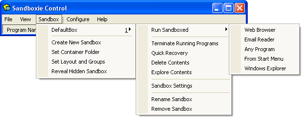

# 沙盒菜单

[沙盒管理器](SandboxieControl.md) > 沙盒菜单

* * *

### 沙盒子菜单

每个已定义的沙盒都会出现一个或多个子菜单。默认配置只包含一个名为 _DefaultBox_ 的沙盒，但可以使用 [创建新沙盒](SandboxMenu.md#创建新沙盒) 命令添加更多沙盒。每个子菜单包含以下命令：

*   _以沙盒方式运行_ 子子菜单用于在 Sandboxie 的监管下启动程序：
*   _网页浏览器_ 命令启动系统（默认）网页浏览器。 
    （注意：如果启动了错误的程序，请参阅[常见问题解答](FrequentlyAskedQuestions.md#为什么沙盒运行默认-web-浏览器时启动了错误的程序)解决。）
*   _邮件阅读器_ 命令启动系统（默认）邮件阅读器。
*   _任意程序_ 命令显示“运行任意程序”对话框，它与标准 Windows 的 _运行..._ 对话框类似。可用于启动程序、打开文档和浏览文件夹，全部在 Sandboxie 的监管下进行。
*   _从开始菜单_ 命令显示 Sandboxie 开始菜单，与标准 Windows 开始菜单类似。可用于启动开始菜单和桌面上出现的程序及其他快捷方式。注意：如果曾向沙盒中安装过程序，Sandboxie 开始菜单将包含安装期间创建的快捷方式。
*   _Windows 资源管理器_ 命令启动 Windows 资源管理器的沙盒化实例。可用于浏览文件夹和启动程序，全部在 Sandboxie 的监管下进行。
*   _终止正在运行的程序_ 命令停止沙盒中运行的所有程序。
*   _快速恢复_ 命令显示 [快速恢复](QuickRecovery.md) 窗口。
*   _删除内容_ 命令显示 [删除沙盒](DeleteSandbox.md) 窗口。
*   _浏览内容_ 命令为沙盒内容打开一个_非沙盒化的_文件夹视图，即_在 Sandboxie 的监管之外_。如有可能，请使用 [文件和文件夹视图](FilesAndFoldersView.md) 浏览沙盒内容。
*   _沙盒设置_ 命令打开 [沙盒设置](SandboxSettings.md) 窗口。
*   _重命名沙盒_ 命令更改沙盒的名称。
*   _移除沙盒_ 命令移除使用 [创建新沙盒](SandboxMenu.md#创建新沙盒) 命令创建的沙盒。

除 _重命名沙盒_ 和 _移除沙盒_ 外，这些命令也出现在 [托盘图标菜单](TrayIconMenu.md) 中。

* * *

### 创建新沙盒

_创建新沙盒_ 命令在 Sandboxie 中定义一个新沙盒。会显示一个对话框，要求输入新沙盒的名称。名称可以是数字和字母的任意组合，最大长度为 32 个字符。通过组合框按钮可以指定某个现有沙盒，其设置将被复制到新沙盒中。如果未选择这样的现有沙盒，新沙盒最初将具有一组默认设置。沙盒创建后，可用 [沙盒设置](SandboxSettings.md) 窗口更改沙盒设置。

* * *

### 设置容器文件夹

_设置容器文件夹_ 命令选择将包含所有其他沙盒的容器（或主、父）文件夹。默认位置是 **X:\Sandbox\%USER%\%SANDBOX%**，其中 **X:** 代表安装 Windows 的驱动器，通常为 **C:**。

特殊变量 **%SANDBOX%** 会被替换为沙盒的名称。

特殊变量 **%USER%** 会被替换为使用该沙盒的用户帐户（或登录）的名称。注意：在一个用户帐户中创建的沙盒，系统上的其他帐户也可以看到和使用。但是，如果容器文件夹包含 **%USER%** 特殊变量，则各用户帐户实际上并不共享同一个沙盒，每个帐户都有沙盒的独立实例。

相关 [Sandboxie Ini](SandboxieIni.md) 设置项：[文件根路径](FileRootPath.md)。

* * *

### 设置布局和组

_设置布局和组_ 命令允许在菜单和列表中显示时，将沙盒排列在组层次结构中。这对程序在沙盒内的行为没有任何影响。当定义的沙盒不止几个时，此功能很有用，因为它允许更方便地从菜单访问特定沙盒。

一旦定义了任何组，[沙盒管理器](SandboxieControl.md) 主 [程序视图](ProgramsView.md) 将包含一个组合框按钮，可用于限制显示的沙盒列表。

相关 [Sandboxie Ini](SandboxieIni.md) 设置项：BoxDisplayOrder。

* * *

### 显示隐藏的沙盒

只有某些沙盒对当前用户帐户不可见或不可用时，_显示隐藏的沙盒_ 命令才会出现在菜单中。可以使用 [沙盒设置](SandboxSettings.md) 窗口中的 [用户帐户设置](UserAccountsSettings.md) 设置页，将沙盒限制为仅供特定用户帐户使用。_显示隐藏的沙盒_ 命令可以恢复对当前用户帐户不可用的沙盒的可见性。

* * *

前往 [沙盒管理器](SandboxieControl.md#菜单)、[帮助主题](HelpTopics.md)。
