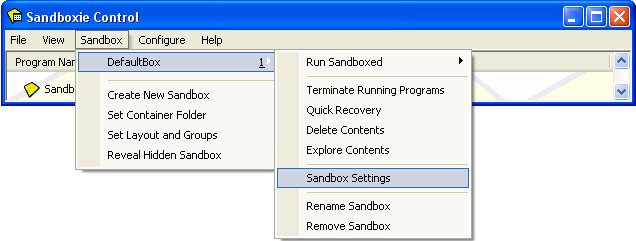
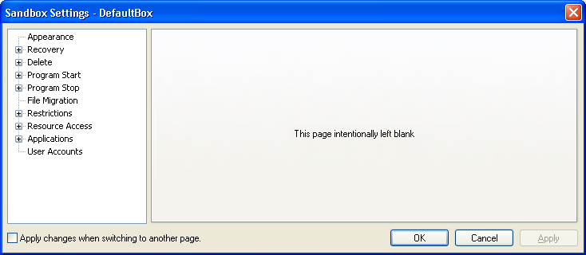

# 沙盒设置

[沙盒管理器](SandboxieControl.md) 中的沙盒设置窗口显示并更改与单个沙盒关联的配置和选项。可以通过两种方式访问沙盒设置窗口：

*   从菜单栏：进入 [沙盒菜单](SandboxMenu.md)，选择列出的沙盒之一，然后选择 _沙盒设置_ 命令：

*   从上下文菜单：在主窗口区域，右键点击（或按 Shift+F10）某个沙盒名称，然后选择 _沙盒设置_ 命令。（更多信息请参阅 [程序视图](ProgramsView.md) 或 [文件和文件夹视图](FilesAndFoldersView.md) 中关于上下文菜单的讨论。）

注意：除非添加了新沙盒，否则 Sandboxie 只列出一个沙盒：DefaultBox。

* * *

在沙盒设置窗口中，各个设置被组织到设置页中，有些页被组织到组中，如下所示。

窗口左侧包含各页和组。在窗口左侧选中（点击）某个设置页时，窗口右侧会显示相关设置。

在某个页中做出更改后，必须先将其应用到 Sandboxie，然后才能移到其他设置页。这可以手动使用“应用”按钮完成，也可以通过勾选窗口底部的复选框（“切换到其他页时应用更改”）自动完成。

以下各节描述每个设置页。

配置更改不适用于在更改配置时已在沙盒中运行的程序。为简单起见，建议在没有程序在沙盒中运行时进行配置更改。

* * *

关于各设置的说明，请参阅以下页面：

*   [外观设置](AppearanceSettings.md)

*   [恢复设置](RecoverySettings.md)

*   [删除设置](DeleteSettings.md)

*   [程序启动设置](ProgramStartSettings.md)

*   [程序停止设置](ProgramStopSettings.md)

*   [文件迁移设置](FileMigrationSettings.md)

*   [限制设置](RestrictionsSettings.md)

*   [资源访问设置](ResourceAccessSettings.md)

*   [应用程序设置](ApplicationsSettings.md)

*   [用户帐户设置](UserAccountsSettings.md)
