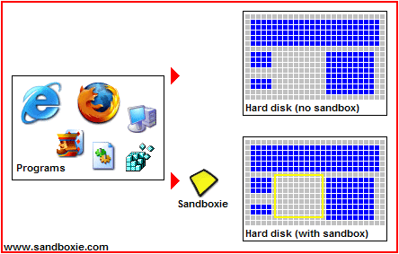
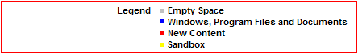

# Sandboxie

厌倦了与流氓软件、间谍软件和恶意软件打交道？花太多时间清理不请自来的软件？担心点击陌生的网页链接？

## 简介

Sandboxie 在一个隔离空间中运行你的程序，防止它们对计算机上的其他程序和数据造成永久性更改。

 

红色箭头表示程序运行时流入计算机的更改。标有 _Hard disk (no sandbox)_ 的方框展示正常运行时的程序产生的更改。标有 _Hard disk (with sandbox)_ 的方框展示在 Sandboxie 保护下运行的程序产生的更改。动画演示了 Sandboxie 如何拦截这些更改，并将它们隔离在**沙盒**（图中黄色矩形）中。同时，将所有更改分组管理，方便一次性全部清除。

## 隔离沙盒的优势

*   **安全浏览网页**：在 Sandboxie 的保护下运行浏览器，意味着浏览器下载的所有恶意软件都会被困在沙盒中，可随时轻松清除。
*   **增强隐私保护**：浏览历史记录、Cookie 和缓存的临时文件均保留在沙盒内，不会泄露到 Windows 系统。
*   **安全收发邮件**：可能隐藏在邮件中的病毒和其他恶意软件无法突破沙盒，无法感染真实系统。
*   **保持 Windows 轻量整洁**：将软件安装到隔离的沙盒中，避免 Windows 因反复安装软件而变得臃肿。

**[立即下载 Sandboxie](https://github.com/sandboxie-plus/Sandboxie/releases/latest) 亲自体验！**

* * *

**查阅 Sandboxie 的 [帮助主题](HelpTopics.md)，或浏览 [支持页面索引](AllPages.md)。**
