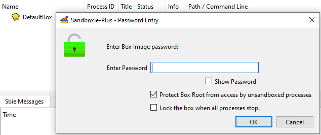

# 使用文件映像

_UseFileImage_ 是 [Sandboxie.ini](SandboxieIni.md) 中的一个沙盒设置项（在 v1.11.0 / 5.66.0 版本中引入），它用一个基于文件的虚拟磁盘映像替换标准的文件系统存储，作为沙盒的根目录。

> [!WARNING]
> 请为每个沙盒单独配置此设置。全局应用此设置将强制所有沙盒使用文件映像，这可能会破坏依赖标准文件系统存储的现有沙盒，或导致与非加密沙盒配置的兼容性问题。

> [!NOTE]
> 此设置需要有效的高级[赞助者证书](https://sandboxie-plus.com/supporter-certificate/)。

## 前提

- 通过 **全局设置** 中的 **附加组件管理器 > 可选附加组件** 选项卡安装 **ImDisk Toolkit**。

    

## 用法

```ini
[DefaultBox]

UseFileImage=y
```

启用此设置后，Sandboxie 服务会创建一个扩展名为 `.box` 的虚拟磁盘映像文件。该映像文件的路径由服务确定[^1]，它会将 `.box` 附加到沙盒的文件根[^2]路径后。然后，沙盒文件系统通过挂载管理器[^3]使用 ImDisk 虚拟磁盘驱动程序从该映像挂载。沙盒内的所有文件 I/O 操作都将重定向到已挂载的映像，而不是直接在主机文件系统上创建文件。

密码保护和映像头备份/恢复操作可通过 SandMan 界面或 ImBox 命令行实用程序进行。

## SandMan 界面

### 设置密码

1. 在 SandMan 中 **右键单击** 沙盒 > `沙盒选项`。
2. 导航到 `文件选项` 选项卡。
3. 启用 `加密沙盒内容`。
4. (可选) 启用 [`挂载时强制保护`](ForceProtectionOnMount.md)。
5. 点击 `设置密码` 按钮。

    

6. 在对话框中输入并确认密码。

    

### 更改密码

1. 在 SandMan 中 **右键单击** 沙盒 > `沙盒选项`。
2. 导航到 `文件选项` 选项卡。
3. 点击 `更改密码` 按钮。

    

4. 在对话框中输入当前密码。

    

5. 在对话框中输入新密码并确认。

### 映像头备份

1. 在沙盒选项的 `文件选项` 选项卡中。
2. 点击 `更改密码` 按钮旁的下拉箭头。
3. 从下拉菜单中选择 `备份映像头`。

    

4. 选择保存 `.hdr` 文件的位置。
5. 映像头将使用 ImBox 实用程序导出[^4]。

### 映像头恢复

1. 在沙盒选项的 `文件选项` 选项卡中。
2. 点击 `更改密码` 按钮旁的下拉箭头。
3. 从下拉菜单中选择 `恢复映像头`。

    

4. 选择之前保存的 `.hdr` 文件。
5. 映像头将使用 ImBox 实用程序导入[^4]。

### 挂载沙盒映像

1. 在 SandMan 中 **右键单击** 沙盒。
2. 从上下文菜单中选择 `挂载沙盒映像`。

    

3. 出现提示时输入 **密码**。

    
    
    - (可选) 启用 `保护沙盒根目录，防止非沙盒进程访问`，以阻止非沙盒程序访问加密的沙盒内容。
    
    - (可选) 启用 `当所有进程停止时锁定沙盒`，以便在最后一个沙盒程序终止时自动卸载映像。

> [!NOTE]
> 通过 UI 从沙盒启动任何程序时，映像会自动挂载。

### 卸载沙盒映像

1. 在 SandMan 中 **右键单击** 沙盒。

    

2. 从上下文菜单中选择 `卸载沙盒映像`。

> [!WARNING]
> 卸载映像将 **终止** 沙盒内所有正在运行的程序。

## 最佳实践

- 尽可能在卸载前手动关闭程序。
- 确保沙盒中没有关键进程在运行。

## 命令行操作

- 使用 `ImBox.exe` 进行高级映像管理：

  ```cmd
  # 备份映像头
  ImBox.exe type=image image="C:\Sandbox\DefaultBox.box" backup="C:\Sandbox\backup.hdr"
  
  # 恢复映像头 
  ImBox.exe type=image image="C:\Sandbox\DefaultBox.box" restore="C:\Sandbox\backup.hdr"
  ```

- 使用 [`Start.exe`](StartCommandLine.md) 进行映像[挂载](StartCommandLine.md#mount-box-images)/[卸载](StartCommandLine.md#unmount-box-images) 操作。

映像挂载由服务处理，该服务在尝试挂载虚拟磁盘之前会验证驱动程序的功能。如果驱动程序不支持加密容器或挂载失败，沙盒将无法启动并会记录错误。

## 技术说明

- 需要 ImDisk 驱动程序支持加密映像容器。
- 与 [UseRamDisk](UseRamDisk.md) 互斥。
- 映像头损坏可能导致加密映像无法恢复——请务必保留映像头备份。
- 最大映像大小受可用磁盘空间和驱动程序限制。
- 命令行挂载操作由 `Start.exe` 使用 `mount` 和 `mount_protected` 开关处理[^5]。

[^1]: `MountManager::GetImageFileName` - 决定映像文件路径。
[^2]: 文件根目录是存储沙盒文件的基础目录，通过 `FileRootPath` 设置进行配置。
[^3]: `MountManager::AcquireBoxRoot` - 处理映像挂载过程。
[^4]: GUI 操作在 `COptionsWindow::OnSetPassword`、`COptionsWindow::OnBackupHeader` 和 `COptionsWindow::OnRestoreHeader` 中实现。
[^5]: 命令行挂载开关在 `Sandboxie\apps\start\Start.cpp` 中实现 - 用于程序化映像挂载操作的 `mount` 和 `mount_protected` 参数。

相关 [Sandboxie Ini](SandboxieIni.md), [ForceProtectionOnMount](ForceProtectionOnMount.md), [UseRamDisk](UseRamDisk.md), [FileRootPath](FileRootPath.md), [StartCommandLine](StartCommandLine.md)
