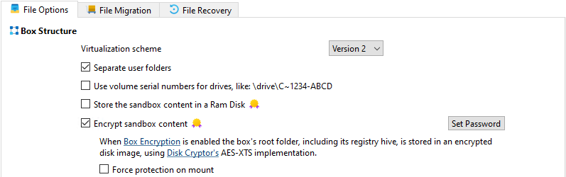
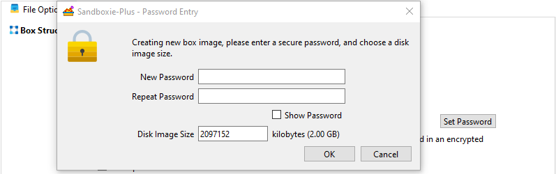
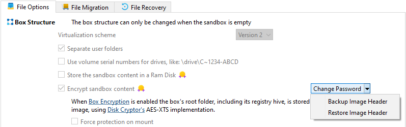
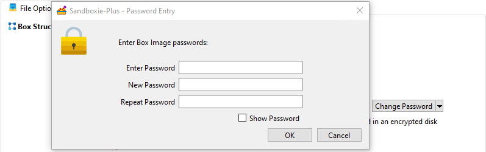
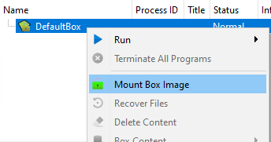
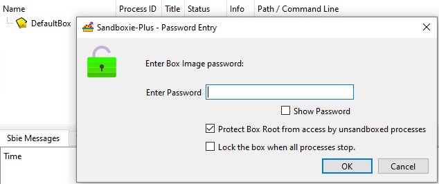
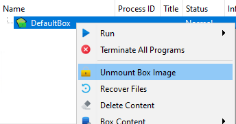

# 使用文件映像

_UseFileImage_ 是 [Sandboxie Ini](SandboxieIni.md) 中的一项沙盒设置（v1.11.0 / 5.66.0 引入），它把标准文件系统存储替换为基于文件的虚拟磁盘映像，作为沙盒根目录。

> [!WARNING]
> 请按沙盒逐一配置此设置。全局应用将强制所有沙盒使用文件映像，这可能会破坏依赖标准文件系统存储的现有沙盒，或与非加密沙盒配置产生兼容性问题。

> [!NOTE]
> 此设置需要有效的进阶 [支持者证书](https://sandboxie-plus.com/supporter-certificate/)。

## 前提条件

- 通过**全局设置**中的**附加组件管理器 > 可选附加组件**选项卡安装 **ImDisk Toolkit**。

    

## 用法

```ini
[DefaultBox]

UseFileImage=y
```

启用此设置时，Sandboxie 服务会创建一个扩展名为 `.box` 的虚拟磁盘映像文件。映像文件路径由服务[^1]确定，它把 `.box` 追加到沙盒文件根[^2]路径。然后通过挂载管理器[^3]使用 ImDisk 虚拟磁盘驱动从该映像挂载沙盒文件系统。沙盒内的所有文件 I/O 操作都会被重定向到已挂载的映像，而不是直接在宿主文件系统上创建文件。

密码保护和头部备份/恢复操作可通过沙盒管理器图形界面或 ImBox 命令行实用程序使用。

## 沙盒管理器图形界面

### 设置密码

1. 在沙盒管理器中**右键点击**沙盒 > `沙盒选项`。
2. 导航到`文件选项`选项卡。
3. 启用`加密沙盒内容`。
4. （可选）启用 [`挂载时强制保护`](ForceProtectionOnMount.md)
5. 点击`设置密码`按钮。

    

6. 在对话框中输入并确认密码。

    

### 更改密码

1. 在沙盒管理器中**右键点击**沙盒 > `沙盒选项`。
2. 导航到`文件选项`选项卡。
3. 点击`更改密码`按钮。

    

4. 在对话框中输入当前密码。

    

5. 在对话框中输入新密码并确认密码。

### 头部备份

1. 在沙盒选项的`文件选项`选项卡中。
2. 点击`更改密码`按钮旁边的向下箭头。
3. 从下拉菜单中选择`备份头部`。

    

4. 选择保存 `.hdr` 文件的位置。
5. 使用 ImBox 实用程序导出头部[^4]。

### 头部恢复

1. 在沙盒选项的`文件选项`选项卡中。
2. 点击`更改密码`按钮旁边的向下箭头。
3. 从下拉菜单中选择`恢复头部`。

    

4. 选择之前保存的 `.hdr` 文件。
5. 使用 ImBox 实用程序导入头部[^4]。

### 挂载沙盒映像

1. 在沙盒管理器中**右键点击**沙盒。
2. 从上下文菜单中选择`挂载沙盒映像`。

    

3. 出现提示时输入**密码**。

    
    
    - （可选）启用`保护沙盒根目录免被非沙盒化进程访问`，以防止非沙盒化程序访问加密的沙盒内容。
    
    - （可选）启用`所有进程停止时锁定沙盒`，使最后一个沙盒化程序终止时自动卸载映像。

> [!NOTE]
> 通过界面从沙盒启动任何程序时，映像会自动挂载。

### 卸载沙盒映像

1. 在沙盒管理器中**右键点击**沙盒。

    

2. 从上下文菜单中选择`卸载沙盒映像`。

> [!WARNING]
> 卸载映像将**终止沙盒内所有正在运行的程序**。

## 最佳实践

- 如有可能，卸载前手动关闭程序。
- 确保沙盒中没有关键进程在运行。

## 命令行操作

- 使用 `ImBox.exe` 进行高级映像管理：

  ```cmd
  # 备份头部
  ImBox.exe type=image image="C:\Sandbox\DefaultBox.box" backup="C:\Sandbox\backup.hdr"
  
  # 恢复头部  
  ImBox.exe type=image image="C:\Sandbox\DefaultBox.box" restore="C:\Sandbox\backup.hdr"
  ```

- 使用 [`Start.exe`](StartCommandLine.md) 进行映像 [挂载](StartCommandLine.md#挂载沙盒镜像)/[卸载](StartCommandLine.md#卸载沙盒镜像) 操作。

映像挂载由服务处理，它在尝试挂载虚拟磁盘之前验证驱动能力。如果驱动不支持加密容器或挂载失败，沙盒将不会启动并记录错误。

## 技术说明

- 需要 ImDisk 驱动支持加密映像容器。
- 与 [使用内存虚拟磁盘](UseRamDisk.md) 互斥。
- 头部损坏可能使加密映像无法恢复——始终保留头部备份。
- 最大映像大小受可用磁盘空间和驱动限制约束。
- 命令行挂载操作由 `Start.exe` 以 `mount` 和 `mount_protected` 开关处理[^5]。

[^1]: `MountManager::GetImageFileName` - 确定映像文件路径。
[^2]: 文件根是存储沙盒文件的基础目录，通过 `FileRootPath` 设置配置。
[^3]: `MountManager::AcquireBoxRoot` - 处理映像挂载过程。
[^4]: 图形界面操作在 `COptionsWindow::OnSetPassword`、`COptionsWindow::OnBackupHeader` 和 `COptionsWindow::OnRestoreHeader` 中实现。
[^5]: `Sandboxie\apps\start\Start.cpp` 中实现的命令行挂载开关 - `mount` 和 `mount_protected` 参数用于编程式映像挂载操作。

相关 [Sandboxie Ini](SandboxieIni.md)、[挂载时强制保护](ForceProtectionOnMount.md)、[使用内存虚拟磁盘](UseRamDisk.md)、[文件根路径](FileRootPath.md)、[启动命令行](StartCommandLine.md)
