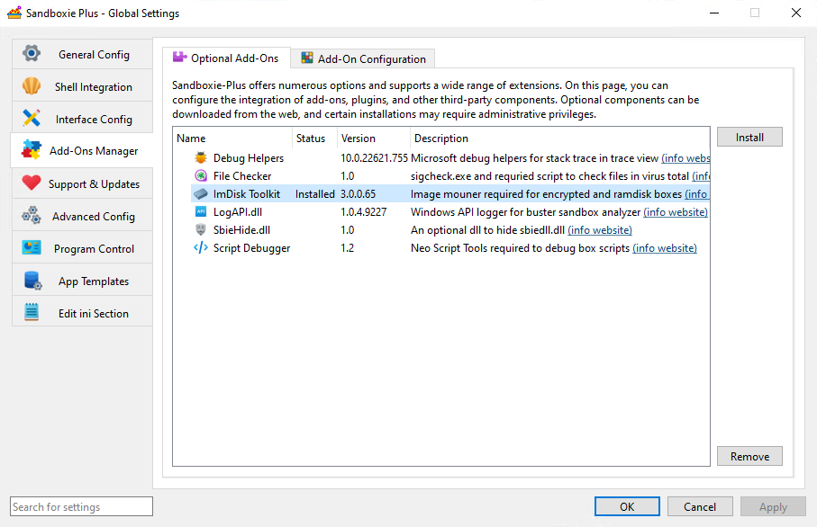
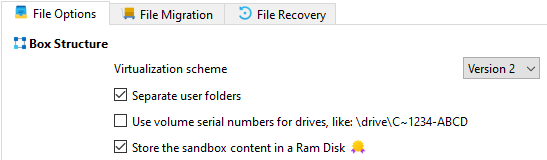

# 使用内存虚拟磁盘

_UseRamDisk_ 是 [Sandboxie.ini](SandboxieIni.md) 中的一个沙盒设置项（在 v1.11.0 / 5.66.0 版本中引入），它用一个基于内存的虚拟磁盘替换标准的文件系统存储，作为沙盒的根目录。

> [!WARNING]
> 请为每个沙盒单独配置此设置。全局应用此设置将强制所有沙盒使用内存虚拟磁盘，这可能会破坏依赖标准文件系统存储的现有沙盒，或导致与非易失性沙盒配置的兼容性问题。

> [!NOTE]
> 此设置需要有效的高级[赞助者证书](https://sandboxie-plus.com/supporter-certificate/)。

## 先决条件

- 通过 **全局设置** 中的 **附加组件管理器 > 可选附加组件** 选项卡安装 **ImDisk Toolkit**。

    

- 配置 [RamDiskSizeKb](RamDiskSizeKb.md) 设置以定义内存虚拟磁盘的大小（单位：KB）。选择一个与您系统的可用内存以及您计划在沙盒中运行的应用程序需求相符的值。

- (可选) 使用 [RamDiskLetter](RamDiskLetter.md) 设置为内存虚拟磁盘分配一个特定的盘符，以便更轻松地访问。

## 用法

```ini
[DefaultBox]

UseRamDisk=y
```

启用此设置后，Sandboxie 服务会完全在系统内存中创建一个虚拟磁盘。该内存虚拟磁盘通过挂载管理器[^1]使用 ImDisk 虚拟磁盘驱动程序进行挂载。沙盒内的所有文件 I/O 操作都将重定向到内存虚拟磁盘，而不是直接在主机文件系统或持久存储上创建文件。

内存虚拟磁盘提供极快的文件操作速度，但它是易失性的——当内存虚拟磁盘被卸载或系统重启时，所有数据都将丢失。这使其成为不需要持久化的临时操作、测试或恶意软件分析的理想选择。

## SandMan 界面

可以通过以下步骤启用内存虚拟磁盘设置：

1. 右键单击沙盒 > `沙盒选项`。
2. 导航到 `文件选项` 选项卡。
3. 启用 `将沙盒内容存储在内存虚拟磁盘中` 设置。

    

## 技术实现

内存虚拟磁盘挂载由服务处理，该服务在尝试挂载虚拟磁盘之前会验证驱动程序功能和可用系统内存[^2]。内存虚拟磁盘的 I/O 操作由 `VirtualMemoryIO` 类管理[^3]，该类与 ImDisk 驱动程序接口[^4]。

如果可用内存不足或挂载失败，沙盒将无法启动并会记录错误。

## 技术说明

- 需要 ImDisk 驱动程序支持虚拟内存操作[^4]。
- 与 [UseFileImage](UseFileImage.md) 互斥。
- 所有数据都是易失性的，在卸载内存虚拟磁盘时会丢失。
- 内存使用通过 `VirtualMemoryIO` 类从系统内存池中分配[^3]。
- 不提供加密或密码保护。
- 没有备份/恢复功能——数据本质上是临时的。
- 性能显著快于基于文件的存储。
- 最大大小受可用系统内存限制，由 `RamDiskSizeKb` 定义。

## 性能考量

- 是临时操作、测试或恶意软件分析的理想选择。
- 减少磁盘 I/O 和对 SSD 的磨损。
- 如果内存虚拟磁盘大小超过可用内存，可能导致系统不稳定。
- 使用大型内存虚拟磁盘时，请监控系统内存使用情况。
- 非常适合不需要数据持久化的场景。

[^1]: `Sandboxie/core/svc/MountManager.cpp` 中的 `MountManager::AcquireBoxRoot` - 处理内存虚拟磁盘挂载过程。
[^2]: 在挂载虚拟磁盘之前，`MountManager::AcquireBoxRoot` 中会执行驱动程序功能检查。
[^3]: 内存虚拟磁盘 I/O 操作由 `SandboxieTools/ImBox/VirtualMemoryIO.cpp` 中的 `VirtualMemoryIO` 类处理。
[^4]: ImDisk 驱动程序头文件和定义位于 `SandboxieTools/ImDisk/inc/imdisk.h`。

相关 [Sandboxie Ini](SandboxieIni.md), [RamDiskSizeKb](RamDiskSizeKb.md), [RamDiskLetter](RamDiskLetter.md), [UseFileImage](UseFileImage.md), [FileRootPath](FileRootPath.md)
