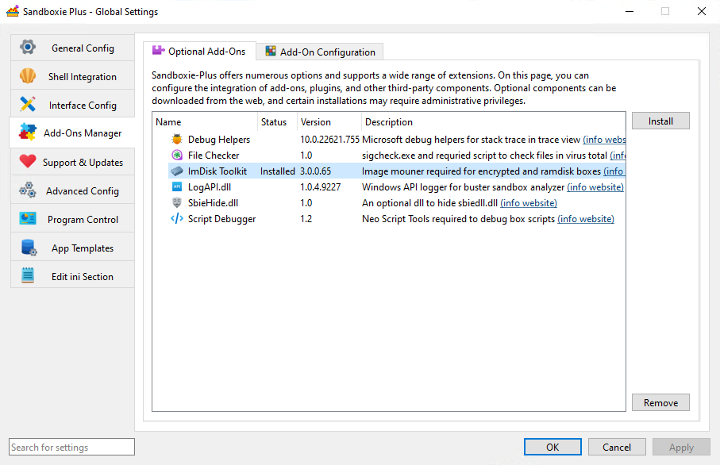
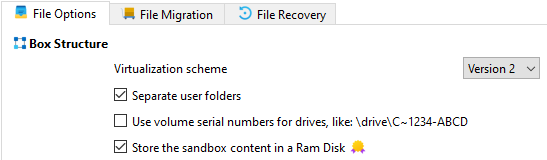

# 使用内存虚拟磁盘

_UseRamDisk_ 是 [Sandboxie Ini](SandboxieIni.md) 中的一项沙盒设置（v1.11.0 / 5.66.0 引入），它把标准文件系统存储替换为基于内存的虚拟磁盘，作为沙盒根目录。

> [!WARNING]
> 请按沙盒逐一配置此设置。全局应用将强制所有沙盒使用内存虚拟磁盘，这可能会破坏依赖标准文件系统存储的现有沙盒，或与非易失性沙盒配置产生兼容性问题。

> [!NOTE]
> 此设置需要有效的 [支持者证书](https://sandboxie-plus.com/supporter-certificate/)。

## 前提条件

- 通过**全局设置**中的**附加组件管理器 > 可选附加组件**选项卡安装 **ImDisk Toolkit**。

    

- 配置 [内存虚拟磁盘大小 (KB)](RamDiskSizeKb.md) 设置，以千字节为单位定义内存虚拟磁盘的大小。选择与系统可用内存以及你计划沙盒化运行的应用程序需求相符的值。

- （可选）使用 [内存虚拟磁盘盘符](RamDiskLetter.md) 设置分配特定盘符，以便更容易访问内存虚拟磁盘。

## 用法

```ini
[DefaultBox]

UseRamDisk=y
```

启用此设置时，Sandboxie 服务会在系统内存中完全创建一个虚拟磁盘。内存虚拟磁盘通过挂载管理器[^1]使用 ImDisk 虚拟磁盘驱动挂载。沙盒内的所有文件 I/O 操作都会被重定向到内存虚拟磁盘，而不是直接在宿主文件系统或持久存储上创建文件。

内存虚拟磁盘提供极快的文件操作，但它是易失的——内存虚拟磁盘卸载或系统重启时所有数据都会丢失。这使它非常适合临时操作、测试或不需要持久性的恶意软件分析。

## 沙盒管理器图形界面

可以通过以下步骤启用内存虚拟磁盘设置：

1. 右键点击沙盒 > `沙盒选项`。
2. 导航到 `文件选项` 选项卡。
3. 启用 `将沙盒内容存储在内存虚拟磁盘中` 设置。

    

## 技术实现

内存虚拟磁盘挂载由服务处理，它在尝试挂载虚拟磁盘之前验证驱动能力和可用系统内存[^2]。内存虚拟磁盘 I/O 操作由 `VirtualMemoryIO` 类[^3]管理，它与 ImDisk 驱动[^4]交互。

如果可用内存不足或挂载失败，沙盒将不会启动并记录错误。

## 技术说明

- 需要 ImDisk 驱动支持虚拟内存操作[^4]。
- 与 [使用文件映像](UseFileImage.md) 互斥。
- 所有数据都是易失的，内存虚拟磁盘卸载时数据丢失。
- 内存使用通过 `VirtualMemoryIO` 类[^3]从系统内存池分配。
- 无加密或密码保护。
- 无备份/恢复功能——数据本质上是临时的。
- 性能明显快于基于文件的存储。
- 最大大小受可用系统内存限制，由 `RamDiskSizeKb` 定义。

## 性能考虑

- 非常适合临时操作、测试或恶意软件分析。
- 减少磁盘 I/O 和对 SSD 的磨损。
- 如果内存虚拟磁盘大小超过可用内存，可能导致系统不稳定。
- 使用大型内存虚拟磁盘时监视系统内存使用。
- 非常适合不需要数据持久性的场景。

[^1]: `Sandboxie/core/svc/MountManager.cpp` 中的 `MountManager::AcquireBoxRoot` - 处理内存虚拟磁盘挂载过程。
[^2]: 挂载虚拟磁盘前在 `MountManager::AcquireBoxRoot` 中执行驱动能力检查。
[^3]: `SandboxieTools/ImBox/VirtualMemoryIO.cpp` 中的 `VirtualMemoryIO` 类处理内存虚拟磁盘 I/O 操作。
[^4]: `SandboxieTools/ImDisk/inc/imdisk.h` 中的 ImDisk 驱动头和定义。

相关 [Sandboxie Ini](SandboxieIni.md)、[内存虚拟磁盘大小 (KB)](RamDiskSizeKb.md)、[内存虚拟磁盘盘符](RamDiskLetter.md)、[使用文件映像](UseFileImage.md)、[文件根路径](FileRootPath.md)
