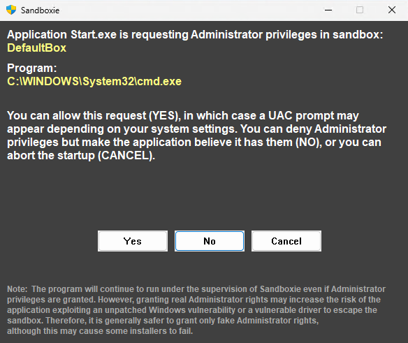

# 使用 Sandboxie UAC

**使用 Sandboxie UAC** 是 [Sandboxie Ini](SandboxieIni.md) 中的一项全局沙盒设置，自 v1.16.0/5.71.0 起可用。启用时，Sandboxie 会拦截并管理沙盒化应用程序发出的 UAC 提升请求。

用法：

```ini
   .
   .
   .
   [GlobalSettings]
   UseSandboxieUAC=y
```

## Sandboxie UAC 提示



| 字段/按钮       | 说明                                                                 |
|--------------------|-----------------------------------------------------------------------------|
| **沙盒**        | 请求来源的沙盒名称（例如"DefaultBox"）。         |
| **程序**        | 请求权限的可执行文件（例如"C:\WINDOWS\System32\cmd.exe"）。 |
| **注意**           | 解释授予真实管理员权限的风险，并出于安全推荐模拟权限，不过某些安装程序可能失败。 |
| **是**            | 授予真实管理员权限（可能触发 UAC 提示）。            |
| **否**             | 授予模拟[^1]管理员权限（应用程序认为自己拥有这些权限）。     |
| **取消**         | 拒绝请求并中止程序启动。                          |

## 行为和配置

默认情况下，Sandboxie 遵循系统的 UAC 配置——当用户帐户控制设置为在安全桌面上提示时，Sandboxie 的 UAC 提示也会出现在那里。可以使用 [安全桌面上的提示](PromptOnSecureDesktop.md) 设置修改此行为，防止沙盒化应用程序在安全桌面上显示提升提示。

## 自定义提示

你可以通过在 Sandboxie Plus 安装目录中放置个性化的 `SbieWallpaper.png` 文件来自定义安全桌面壁纸。此图像将显示为安全桌面上的背景。

## 相关配置

此设置对应 **Sandboxie Plus** 中以下路径的图形界面选项：

**选项** > **全局设置** > **高级配置**：_使用 Sandboxie 自己的增强 UAC 提示（实验性）_。

[^1]: 更多信息参见 [FakeAdminRights](FakeAdminRights.md)。
