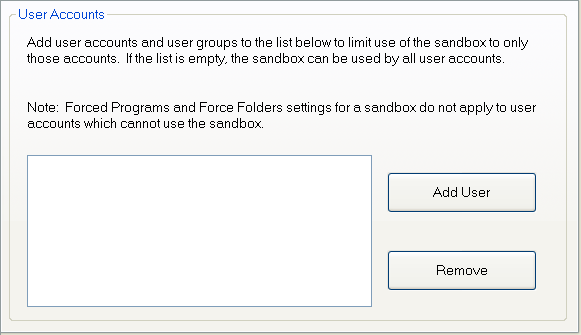

# 用户帐户设置

[沙盒管理器](SandboxieControl.md) > [沙盒设置](SandboxSettings.md) > 用户帐户：

此设置页可以把此沙盒的使用限制为特定用户帐户。_添加用户_ 按钮打开一个标准 Windows 用户帐户选择对话框，可用于查找和选择特定用户帐户。也可以指定用户帐户组。

已限制为特定用户的沙盒，对所有其他用户帐户而言被视为隐藏。那些其他用户帐户不会在 [沙盒管理器](SandboxieControl.md) 中看到列出的该沙盒，且 [强制程序](ProgramStartSettings.md#强制程序) 和 [强制文件夹](ProgramStartSettings.md#强制文件夹) 设置也不适用于那些用户帐户。

对隐藏了任何沙盒的用户帐户，[沙盒管理器](SandboxieControl.md) 的 [沙盒菜单](SandboxMenu.md) 中会出现 [显示隐藏的沙盒](SandboxMenu.md#显示隐藏的沙盒) 命令。

相关 [Sandboxie Ini](SandboxieIni.md) 设置项：[启用](Enabled.md)
