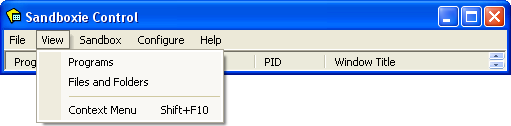

# 视图菜单

## 程序

程序命令选择 [程序视图](ProgramsView.md)，该视图显示每个沙盒中运行的程序。这是默认视图。

## 文件和文件夹

文件和文件夹命令选择 [文件和文件夹视图](FilesAndFoldersView.md)，该视图显示每个沙盒中的文件和文件夹。

## 上下文菜单

上下文菜单命令显示与当前高亮（选中）项相关联的上下文菜单。上下文菜单也可以通过右键点击某个项来显示。项可以是沙盒、程序、文件或文件夹。并非所有项都出现在所有视图中。
