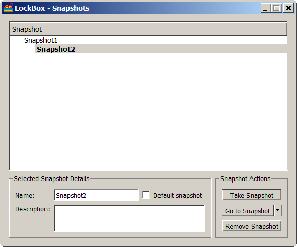

# 沙箱快照（适用于 Sandboxie Plus）

**快照**可以保存沙箱的当前状态。你可以在不同时刻为一个沙箱创建多个快照，并将其中一个快照设为默认快照。要开始使用，请打开 Sandman 图形界面，在目标沙箱上点击右键，并从下拉菜单中选择“快照管理器”。参见下图。

- 注意，如果沙箱为空，无法创建快照（会显示错误信息）
- 注意，如果沙箱内存在运行中的进程，同样无法创建快照

**注意事项：**快照只能在禁用沙箱自动删除的情况下创建。要进行设置，请打开 Sandman 图形界面，双击目标沙箱，弹出沙箱选项窗口。接着，点击“文件选项”，在“沙箱删除选项”下，取消勾选“自动删除内容”，然后点击右下角的“确定”应用更改。参见下图。

**向沙箱中安装软件并创建快照：**

- 选择一个沙箱，禁用自动删除功能，将软件安装在该沙箱中，并完成相关设置
- 然后，关闭沙箱，创建快照，并启用沙箱自动删除功能
- 现在，每当关闭该沙箱时，它会自动还原到你所创建的快照状态

**更新已安装于沙箱的软件：**

- 首先创建更新前的快照（以便需要时可以回退至该基线状态）
- 禁用沙箱自动删除，更新并测试软件
- 如果一切正常，创建更新后的快照，并启用自动删除
- 此操作会自动将最新（更新后）的快照设为默认快照
- 如遇问题，你可以回退至更新前的快照
- 你始终可以将沙箱回退到任意一个已创建的快照

你可以创建快照、删除快照、回退至某个快照，或者（从 **Sandboxie Plus v1.0.9** 起）在保留全部快照的情况下还原为空沙箱

**注意事项：**建议仅对存储于真实磁盘（而非内存盘 ramdisk）上的沙箱使用快照功能

**补充说明：**

- 每一个快照都会建立一个独立文件夹，命名格式为 snapshot-n，其中 n 是快照编号。你可以修改该名称
- 某个沙箱的所有快照文件夹都位于该沙箱文件夹内
- 快照结构以及当前（默认）快照的信息，会保存在沙箱文件夹内的 **snapshot.ini** 文件中
- **文件系统**快照是增量方式，仅当文件发生更改时才会复制（类似主机上的真实文件）
- **注册表**快照不是增量方式，每个快照均拥有完整的注册表副本，而且只有最新的注册表文件会被使用
