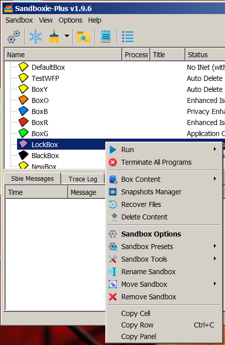
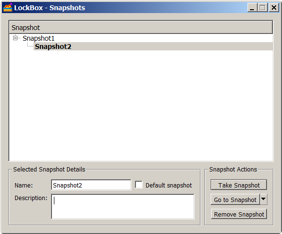
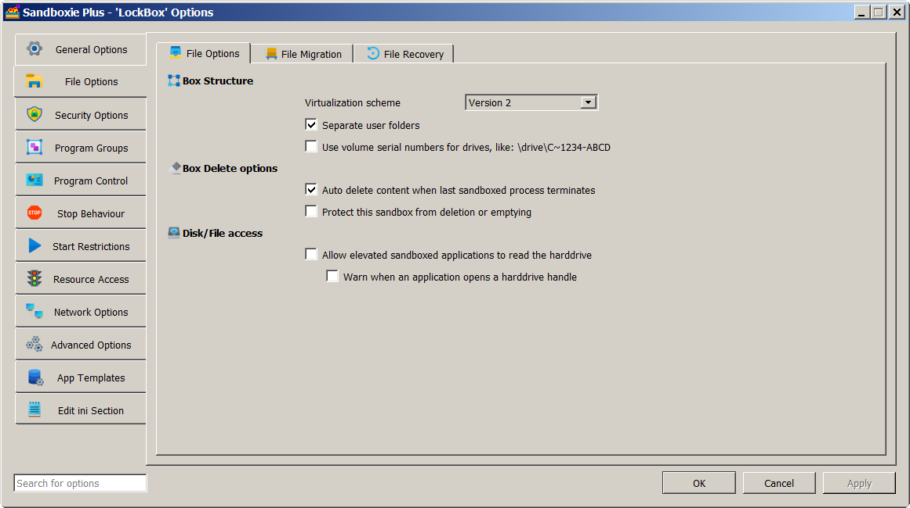

# 沙盒快照

Sandboxie Plus 中，快照管理通过 SandMan 提供。从沙盒菜单打开**「快照管理器」**即可创建和管理沙盒的已保存检查点。在高级菜单布局中，该命令位于**「沙盒工具 → 快照管理器」**。



文件系统快照数据以增量方式存储，而每个快照都包含一份完整的已保存注册表状态。快照被创建或选中之后，新的可变改动会继续叠加在活动快照之上的实时沙盒状态中。

## 快照模型

Sandboxie 区分已保存的快照和当前的可变状态：

- **活动快照**：实时沙盒状态所基于的已保存快照。
- **实时状态**：活动快照被创建或选中之后所做的可变改动。它本身不是已保存快照。
- **默认快照**：单独选择的清理目标。它独立于活动快照，不控制沙盒的正常运行。
- **空沙盒状态**：没有活动快照。即使活动状态为空，已保存快照仍可能存在。

文件系统视图由活动快照、其父快照以及当前的实时改动共同构成。

## 创建快照

拍摄、切换和移除快照都要求该沙盒中所有沙盒进程处于停止状态。**「抓取快照」**还要求沙盒包含已初始化且非空的内容。

创建快照时：

1. 当前实时状态被保存为一个新快照。
2. 先前的活动快照成为新快照的父级。
3. 新快照成为活动快照。
4. 默认快照保持不变。
5. 在新活动快照之上继续一个全新的实时可变层。

因此新建的快照随即成为活动快照。默认快照是单独选择的。



[自动删除](../Content/AutoDelete.md)在技术上不会阻止快照创建。不过在准备或更新沙盒期间停用它可能有用，因为自动清理可能会在最后一个沙盒进程退出时丢弃实时改动。这是工作流建议，不是**「抓取快照」**的要求。

## 活动快照与默认快照

活动选择和默认选择可以不同。例如快照 B 可以是活动的，而快照 A 仍作为默认清理目标。活动状态也可以为空而 A 仍为默认，或者 B 活动而未选中任何默认。即使还有已保存快照可用，两个选择都可能为空。

活动快照决定当前实时改动所基于的已保存快照链。默认快照只被请求默认目标的清理行为使用。

在快照管理器中选中一个已保存快照，并用**「默认快照」**复选框设置或清除默认。创建快照不会改变该选择。

## 切换快照

用**「进入快照」**使某个已保存快照成为活动快照。此时不允许有沙盒进程运行。SandMan 会警告当前状态将在继续前被删除。

切换快照时：

- 丢弃未保存的实时改动；
- 恢复所选快照的已保存注册表状态；
- 使所选快照成为活动快照；
- 保留正在离开的已保存快照和所选的目标快照；
- 默认快照选择保持不变。

切换快照会丢弃未保存的实时状态。它不会删除你正在离开的已保存快照。

## 恢复到空沙盒

**「恢复到空沙盒」**操作会清除实时状态，同时保留已保存快照。操作之后，没有任何已保存快照处于活动状态。以后仍可再次选择某个已保存快照。

这种空沙盒状态不同于没有已保存快照的空沙盒。它也不同于**「抓取快照」**上的限制——后者需要已初始化内容才能捕获。

## 快照层级

快照构成父子树，并且可以分支。例如：

```text
快照 A
├── 快照 B
└── 快照 C
```

这可能发生在 A 活动、创建了 B、用户切回 A、随后创建了 C 的情形。B 和 C 都以 A 为父级。

在运行时，只有从活动快照向上到其祖先的链条才对当前文件系统视图有贡献。因此快照历史不一定是线性的。

## 移除快照

移除快照取决于所选快照在层级中的位置：

- 非活动的叶节点快照可以直接移除。
- 只有一个子节点的快照可以合并到该子节点，使子节点保持可用。
- 被多个子分支共享的快照不能简单移除。
- 移除活动快照仅在受支持的层级情形下可用；已保存数据可能会合并进当前实时状态。

移除可能合并快照数据，而不只是删除一个内部目录。SandMan 会请求确认，并且所有沙盒进程必须已停止。

如果某个快照被标记为默认，必要时请先单独选择或清除所需的默认。不要假定另一个快照会自动成为默认。

## 自动与手动清理

### 自动删除（AutoDelete）

启用自动删除时，当前 SandMan 版本可以配置为把沙盒恢复到活动快照状态或所选默认快照。该选项位于**「沙盒选项 → 文件选项 → 沙盒删除选项」**。



当没有已保存快照处于活动状态时，活动目标可以表示空沙盒状态。启用 AutoDelete 不会自动选择或更改默认快照。

### 删除内容

存在已保存快照时，手动删除内容可以保留或移除它们。若保留快照，清理将恢复到默认快照；若未选中默认，则恢复到空沙盒状态。

删除对话框还可以提供**「同时删除所有快照」**。选择该项会让已保存的快照存储在完整清理中一并被移除。一般内容删除工作流参见[删除沙盒](../Content/DeleteSandbox.md)。

### 文件恢复

[快速恢复](../Content/QuickRecovery.md)和[自动恢复](../Content/AutoRecover.md)恢复单个文件。快照切换改变的是沙盒状态本身。切换和移除快照使用它们自己的确认机制，不会调用快速恢复。

## 快照管理器

快照管理器提供以下相关控件：

- **「抓取快照」**；
- **「刷新视图」**；
- **「进入快照」**；
- **「恢复到空沙盒」**；
- **「移除快照」**；
- 可编辑的**「名称」**和**「描述」**字段；
- **「默认快照」**复选框；
- **「快照」**和**「创建时间」**列。

名称和描述是可编辑的元数据。没有单独的**「重命名快照」**操作。更改显示名称不会重命名内部的快照存储目录。活动快照在快照树中以高亮显示，所选默认也有相应标记。

## 存储模型与限制

快照元数据存储在沙盒存储根目录下的 **Snapshots.ini** 中。它记录活动和默认选择、父子关系、显示名称、描述和创建时间戳。

已保存的文件系统层使用 `snapshot-<ID>` 之类的内部目录。这些名称是实现细节，不应手动重命名。快照管理器允许你更改快照的显示名称而不重命名其内部存储目录。

文件系统快照存储是增量的。创建快照保存的是当前文件系统层，而不是克隆整个沙盒树；文件解析使用活动快照链加当前实时状态。快照机制不应被理解为硬链接、目录联接（junction）或符号链接的集合。

每个快照包含一份完整的已保存注册表状态。切换快照时，所选活动快照的注册表状态会被恢复到实时沙盒中。活动快照可以是较旧的分支，不一定是最近创建的快照。

快照的持久性取决于底层沙盒存储是否可用。如果仍有进程在运行、快照已不存在、数据无法复制或恢复、共享父级无法安全移除，或沙盒存储无法修改，快照操作可能失败。不应假定快照操作在存储失败后提供事务性回滚。

## Sandboxie Plus 与经典版

快照管理通过 Sandboxie Plus 中的 SandMan 提供。底层的快照感知文件系统支持在内部共享，但 Sandboxie Control 经典版不提供快照管理器界面。参见[功能对比](../Content/FeatureComparison.md)。

## 相关页面

- [自动删除](../Content/AutoDelete.md)
- [删除沙盒](../Content/DeleteSandbox.md)
- [快速恢复](../Content/QuickRecovery.md)
- [自动恢复](../Content/AutoRecover.md)
- [功能对比](../Content/FeatureComparison.md)
