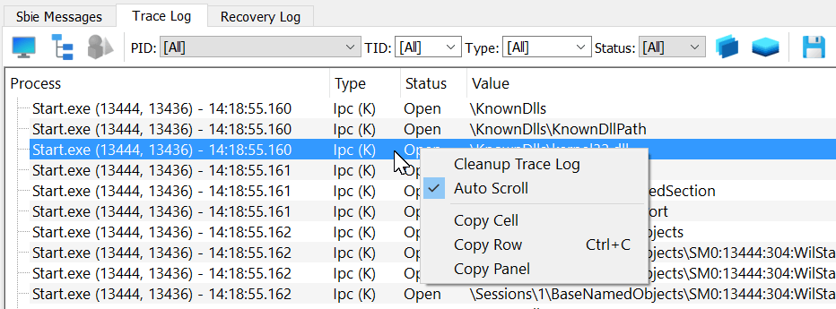

# 跟踪日志（适用于 Sandboxie Plus）

跟踪日志会显示沙盒程序产生的资源访问和其他诊断记录。它是 Sandboxie Plus 中查看 [Sandboxie 跟踪](../Content/SandboxieTrace.md) 选项所用共享监控器的界面。

**重要提示：** 在开启新问题之前，请考虑使用跟踪日志。

关于实战工作流——当前哪些追踪设置有效、如何确认记录确实在采集、如何读日志找出缺失的访问规则——请参阅[实战追踪指南](tracing-in-practice.md)。



## 使用跟踪日志

1. 通过**「视图(V)」→「跟踪日志记录」**启用**跟踪日志**选项卡。
2. 跟踪日志选项卡激活后，会立即开始收集并显示所有正在运行的沙盒程序的资源访问信息。
3. 此时，执行在 Sandboxie Plus 监管下会失败的任何特定操作。
4. 检查或过滤收集到的记录。右键选择**「复制面板」**复制数据，或用保存动作写入日志文件。
5. 现在可以将收集到的数据粘贴（Ctrl+V）到某处，供分析使用。
6. 需要时用 Ctrl+F 搜索特定条目。

启用跟踪日志会激活监控和显示管线。但它**不会自动启用所有详细设置**（例如 `FileTrace`、`KeyTrace`、`IpcTrace`、`PipeTrace`、`CallTrace`、`GuiTrace`）。这些选项需要在**「沙盒选项 → 高级选项 → 追踪」**下或直接在 [Sandboxie Ini](../Content/SandboxieIni.md) 中单独配置。没有这些配置，跟踪日志会是完全空白的。

## 栈追踪与进程信息

**「显示栈追踪」**控制 `MonitorStackTrace`；仅打开跟踪日志不会启用栈采集。只有在该选项对新创建的监控缓冲区生效之后，栈信息才会随监控条目一并采集，随后由 SandMan 异步解析符号。

更改**「显示栈追踪」**后，请停止跟踪日志再重新启动，以确保启用或停用可靠生效。栈采集和符号解析会带来诊断开销，并且符号下载可能涉及网络访问。

在集成跟踪日志处于活动状态期间，SandMan 会临时启用**「保留终止的程序」**，并在跟踪停止时恢复用户保存的偏好。保留进程信息有助于 SandMan 进行进程命名和符号处理；它不是启用底层栈采集的开关。

## 缓冲区大小

`TraceBufferPages` 可以请求更大的共享监控缓冲区。例如：

```ini
[GlobalSettings]
TraceBufferPages=2560
```

此示例不代表有文档依据的字节或 MiB 换算。更改后请停止并重新启动跟踪日志。当前行为和溢出注意事项参见 [Sandboxie 跟踪](../Content/SandboxieTrace.md)。

## 性能影响

跟踪日志停用时，SandMan 不会保留其活动的监控缓冲区。单独启用的追踪设置仍可能在跟踪日志查看器关闭时于沙盒进程内部安装钩子或增加开销。活动跟踪期间的开销取决于所选诊断项和事件量。

## 版本历史

> **Sandboxie Plus v0.7.0** 增加了用 `TraceBufferPages` 调整监控缓冲区大小的能力。
>
> **Sandboxie Plus v0.8.0** 增加了用 `DisableResourceMonitor=y` 为选定沙盒禁用资源访问监控的能力。
>
> **Sandboxie Plus v0.9.8b** 增加了将跟踪日志输出保存到新的 .log 文件的功能（通过软盘图标）。
>
> **Sandboxie Plus v0.9.8d** 增加了同时选择多种访问类型的功能。
>
> **Sandboxie Plus v1.0.16** 为资源访问跟踪添加了监控模式。
>
> **Sandboxie Plus v1.9.6** 为监控记录增加了可选启用的栈信息。集成跟踪日志处于活动状态期间，SandMan 还会临时启用**「保留终止的程序」**，以保留用于进程命名和符号处理的进程信息。
>
> **Sandboxie Plus v1.10.1** 增加了自动滚动功能（在监控模式下默认启用）。
