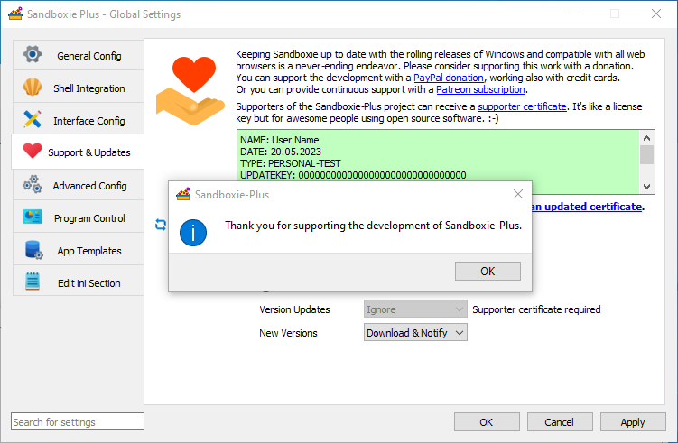

# 使用现代 SandMan 界面申请支持者证书

要申请支持者证书，请启动 Sandboxie Plus 并打开全局设置：

在全局选项中，请前往 “支持 & 更新” 页面：

输入完整的证书内容，从 NAME: 开始，直到最后的两个等号 ==，然后点击 应用（或 确认）：

接下来系统会提示您授予管理员权限，您需要允许权限才能安装证书：

根据您的操作系统预设，您可能还需要确认 UAC 提示：

证书被接受后，输入框应该会变为绿色：

并且会弹出通知窗口。
