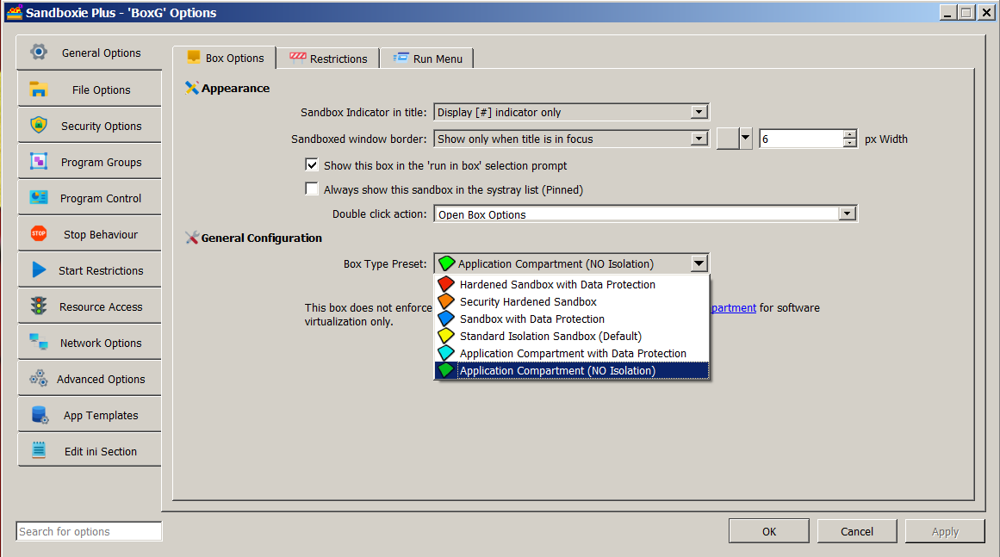

# App Compartment（应用程序隔离）

> [!NOTE]
> 此功能需要[支持者证书](https://sandboxie-plus.com/supporter-certificate/)。

App Compartment 随 Sandboxie Plus 1.0.0 引入。它在保留部分 Sandboxie 虚拟化和策略机制的同时，绕过若干安全隔离机制，从而优先保证应用程序兼容性。

> [!WARNING]
> App Compartment 会实质性降低隔离强度，只应用于有兼容性需求的受信任应用程序。它不等同于不使用 Sandboxie；仅保留文件和注册表虚拟化不应被视为安全边界。

## 配置

主要沙盒设置为：

```ini
[DefaultBox]
NoSecurityIsolation=y
```

在 SandMan 中，在**「沙盒选项 → 常规选项」**下选择**「应用程序隔离」**沙盒类型。新建沙盒向导称对应的预设为**「应用程序隔离沙盒」**。沙盒状态列通常将结果标识为**「应用程序隔离」**。

如果配置还打开了整个资源根，例如 `OpenFilePath=*`，SandMan 会改为显示**「OPEN Root Access」**。该状态警告的显示优先级高于**「应用程序隔离」**；它不改变已配置的沙盒类型，也不停用 `NoSecurityIsolation`。

底层高级控件位于**「沙盒选项 → 安全选项 → 安全隔离」**，标签为**「禁用安全隔离」**。



## 安全与兼容模型

App Compartment 绕过 Sandboxie 常规的受限主令牌替换路径和常规的模拟令牌过滤路径。它还会把进程排除在 Sandboxie 常规根作业对象（Job Object）分配之外，并放宽若干面向安全的路径策略默认值。

App Compartment 本身**不会**提升进程权限。相反，它绕过 Sandboxie 常规的受限令牌替换，因此进程可以保留其启动时的安全上下文。未提权的进程保持未提权；而刻意以提权启动的进程可以保留该提权上下文。

文件系统和注册表虚拟化可以保持活动。文件、注册表键和内核对象的驱动过滤仍然是独立机制，不会仅因选择 App Compartment 而被停用。已配置的资源、网络、IPC 和 GUI 规则可以继续生效。

详细行为和限制参见[禁用安全隔离](../Content/NoSecurityIsolation.md)。

## AppContainer 令牌行为

App Compartment 不安装标准沙盒的 `CreateAppContainerToken` 和 `CreateAppContainerProfile` 兼容性钩子，也不通过该标准沙盒分支抑制 AppContainer 的进程创建属性。`DropAppContainerToken` 在此模式下默认为 `n`。显式启用它可以在 Sandboxie 常规受限主令牌替换已被绕过的情况下移除调用方提供的 AppContainer 令牌限制，从而削弱令牌隔离但不授予提权。

历史上的 `FakeAppContainerToken` 设置不控制当前的 compartment 行为。API 和子进程创建这两个独立阶段参见 [AppContainer 令牌兼容性](../Content/AppContainerTokens.md)。

## 可选的过滤放宽

为进一步提升兼容性，App Compartment 沙盒可以使用：

```ini
NoSecurityFiltering=y
```

该设置在 App Compartment 活动期间停用 Sandboxie 驱动层的文件、注册表键和内核对象过滤器。它并不是字面意义上停用每一个 Sandboxie 钩子、服务、规则或虚拟化机制。参见[无安全过滤](../Content/NoSecurityFiltering.md)。

在 SandMan 中，复选框**「禁用安全过滤（不推荐）」**位于同一个**「安全隔离」**页，并且只有在选中**「禁用安全隔离」**时才可用。

## 路径与命名空间处理

Sandboxie 会为 App Compartment 进程加载内置的 `TemplateAppCPaths` 规则。自 Sandboxie Plus 1.8.0 起，此模式的内置路径规则维护在该专用模板中。这些规则提供沙盒类型专用的路径策略；它们并不停用所有资源隔离。

常规的 NT 目录对象命名空间隔离是一个独立设置。高级的 App Compartment 配置可以改用 `UseAlternateIpcNaming=y`，它为 Sandboxie 重定向的命名内核对象提供沙盒专用的名称后缀，而不使用常规的独立目录对象命名空间。这不会重命名每一种 IPC 机制。参见 [NT 命名空间隔离](../Content/NtNamespaceIsolation.md)。

## 作业对象限制

App Compartment 进程不会被分配到 Sandboxie 常规的根作业对象。通过该作业对象实现的沙盒级进程、内存和 CPU 限制因此通常不适用。参见[作业对象](../Content/JobObjects.md)。

## 版本历史

- **Sandboxie Plus 1.0.0 / Classic 5.55.0：** 通过 `NoSecurityIsolation=y` 引入 App Compartment，以及可选的 `NoSecurityFiltering` 兼容性设置。
- **Sandboxie Plus 1.8.0：** 将内置的 App Compartment 访问规则迁移到 `TemplateAppCPaths`。
- **Sandboxie Plus 1.17.0 / Classic 5.72.0：** 为 App Compartment 沙盒添加 `UseAlternateIpcNaming`，用于备用的命名对象处理。

## 旧版本说明（迁移提示）

旧版本文档中的以下行为说明仍然有效：

自 **Sandboxie Plus v1.0.16** 起，新安装默认启用全新对象访问过滤器，对进程隔离起到辅助作用，替代了 Sandboxie 旧有的进程/线程句柄过滤。在 **Sandboxie Plus v1.0.0** 起的早期版本中启用该功能，可在 [GlobalSettings] 部分添加 `EnableObjectFiltering=y`。

后续版本引入了基于令牌的兼容性方案以提升与常见程序的兼容性。这些方案采用 `DropAppContainerToken=y` 实现，若需对某一特定程序禁用，可使用 `FakeAppContainerToken=program.exe,n`。在 **v1.8.2a** 及更高版本中，App Compartment 模式默认禁用这些兼容性方案。如果某些程序（主要为浏览器）出现问题，可通过添加 `DeprecatedTokenHacks=y` 重新启用。**v1.8.0** 将 App Compartment 沙盒的内建访问规则迁移到 `Templates.ini` 的 `[TemplateAppCPaths]` 部分。**v1.10.1** 修复并完善了长期存在的各种影响 App Compartment 沙盒的 bug。

**趣闻（适用于任何沙盒类型）：** 如果在沙盒设置中添加 `OpenFilePath=*`（或以其他方式禁用隔离），沙盒管理器状态栏会显示 **OPEN Root Access**，警示该沙盒已不再是真正意义上的"沙盒"。自 **v1.3.2** 起，沙盒图标的默认颜色也会相应变化。

## 相关页面

- [禁用安全隔离](../Content/NoSecurityIsolation.md)
- [无安全过滤](../Content/NoSecurityFiltering.md)
- [NT 命名空间隔离](../Content/NtNamespaceIsolation.md)
- [作业对象](../Content/JobObjects.md)
- [Sandboxie Ini](../Content/SandboxieIni.md)